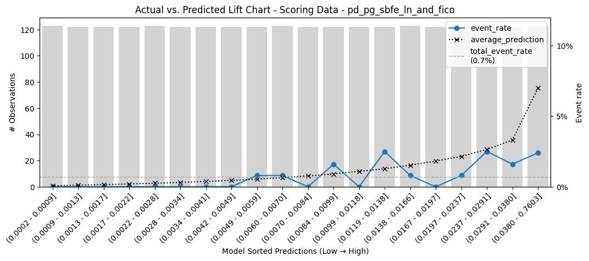
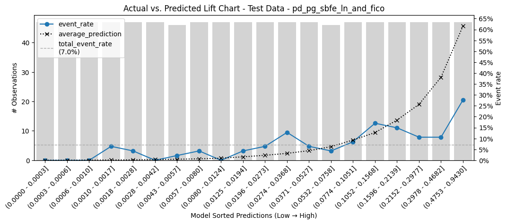
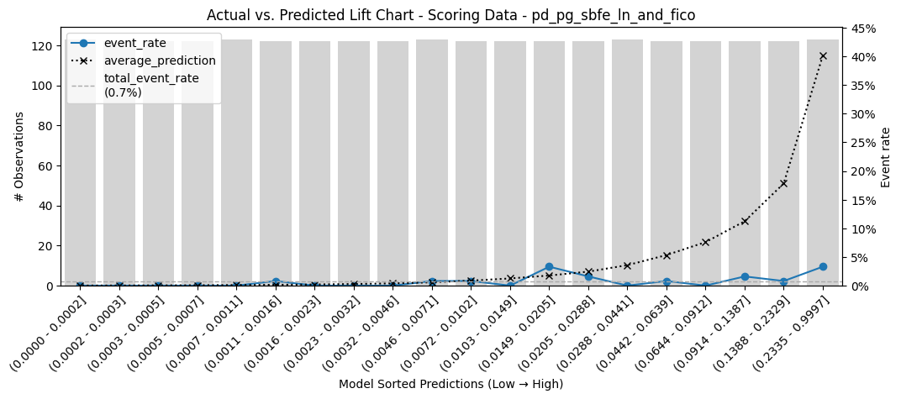
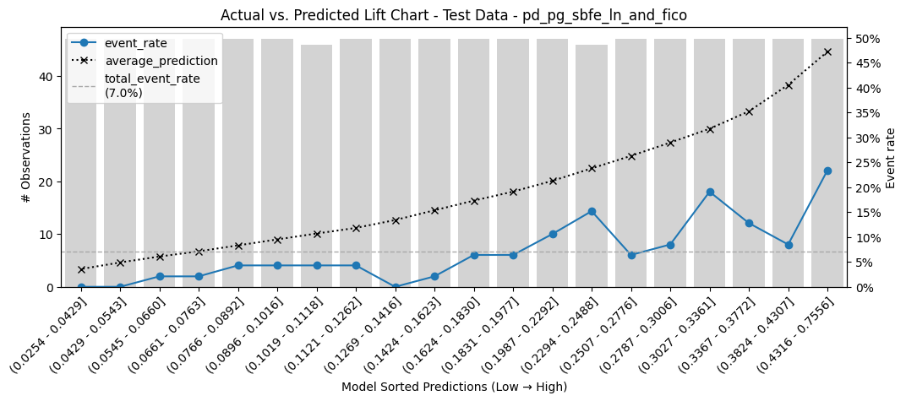

# otr_adj_model_flow_proposal

This project aims to retrain the ORT adjudication model with a new definition of segments and flow according to some insights found during the monitoring framework implementation.

## 11/18/2024 8:30 AM

### Project Setup

The following steps were taken to set up the project:

1. **Project Creation and GitHub Connection:** The project was created and connected to a GitHub repository for version control and collaboration.
2. **Virtual Environment Creation:** A virtual environment was created to isolate project dependencies and ensure reproducibility.
3. **Project Organization:** The project directory was organized with the following folders:
    - **datasources:** This folder stores the original BCG datasets.
    - **notebooks:** This folder contains Jupyter notebooks used for data exploration, analysis, and visualization.
    - **code_resources:** This folder stores any scripts or modules developed for the project.
4. **Data Ingestion:** The original BCG datasets were added to the `datasources` folder.
5. **Branching and Merging:** A new branch was created for development, and after the initial setup, it was merged to the main branch.

### Future Work

- Develop data cleaning and preprocessing scripts.
- Create a master table by merging and transforming the BCG datasets.
- Develop data analysis and visualization notebooks.
- Document the data sources and the master table schema.

### Contributing

Contributions to this project are welcome. Please follow these steps:

1. Fork the repository.
2. Create a new branch for your feature or bug fix.
3. Make your changes and commit them with descriptive commit messages.
4. Push your changes to your fork.
5. Submit a pull request to the main branch.

## License

This project is licensed under the MIT License. See the LICENSE file for details.

## 11/18/2024 11:34 AM

### Data Sources

The LexisNexis data used in this project comes from two main sources:

1. **BCG's Original OTR Adjudication Model:** This model, found in the Dataiku project [OTR_ADJUDICATION_RISK/](https://dataiku-dss.prod-us-west-2.data.wexapps.com/projects/OTR_ADJUDICATION_RISK/), utilizes two LexisNexis files:
    - `data_lexisnexis.csv`: Contains LN information for applications before 2022, including 53,468 rows and the following columns: `name`, `b2bcnt2y`, `model2score`, and `sbfecardcount`.
    - `data_lexisnexis_2022.csv`: Contains LN information for applications in 2022, including 112,523 rows and the following columns: `accountnumber`, `b2bcnt2y`, `model2score`, and `sbfecardcount`.

2. **New LexisNexis Files:** These files, documented in the Confluence page [LexisNexis One-time Data Directory for NAM and OTR Adjudication Models](https://wexinc.atlassian.net/wiki/spaces/RDS/pages/154849771521/LexisNexis+One-time+Data+Directory+for+NAM+and+OTR+Adjudication+Models), are provided as replacements for the BCG files:
    - `final_wex_11529_sba21_sbfe_sbfescore_pr3.csv`: Covers the period from 01/2021 to 12/2021, joined using either `CREATED_DATE` or `DATE_DECISIONED_C`. Contains `Accountnumber` (ID) and `historydateyyyymm`.
    - `final_wex_11795_otradjud_sba21_sbfe_sbfescore.csv`: Covers the period from 01/2022 to 05/2023, joined using either `CREATED_DATE` or `DATE_DECISIONED_C`. Contains `Accountnumber` (ID) or `NAME` and `historydateyyyymm`.

### Data Validation and Reconciliation

The goal of this section is to:

1. **Replace the LexisNexis plain CSV files:** Replace the LexisNexis plain CSV files used in current model training with more complete files, checking for concordance in the data.
2. **Validate Application Counts:** Compare the number of applications in the new files with the corresponding periods in the BCG files to ensure consistency.
3. **Verify Feature Values:** Compare the values of the shared feature `sbfecardcount` between the new and BCG files to ensure data integrity.

This validation process will help identify any discrepancies between the new and old LexisNexis data, ensuring the accuracy and reliability of the OTR master table.

## LexisNexis Data Validation: Pre-2022 Data

This section details the validation process comparing the new and current LexisNexis datasets for applications before 2022.

### Datasets

* **New Data (2021):** `final_wex_11529_sba21_sbfe_sbfescore_pr3.csv`
* **Current Data (2021):** `data_lexisnexis.csv` (from BCG's original OTR adjudication model)

### Comparison Results

The comparison focused on ensuring consistency in terms of rows, null values, data types, and shared feature values.

**1. Structural Comparison:**

* **Rows:** Both datasets contain 52,468 rows.
* **Columns:** The new dataset has 21 columns, while the current dataset has 4 columns.
* **Column Names:** The new dataset includes additional features not present in the current dataset. Both share the following columns: `name`, `b2bcnt2y`, `model2score`, and `sbfecardcount`.
* **Data Types:** Data types for shared columns are consistent across both datasets.

**2. Null Value Comparison:**

* Both datasets exhibit the same number of null values for the shared columns (`b2bcnt2y` and `sbfecardcount`).

**3. Value Comparison:**

* A merge operation was performed to compare the values of shared columns.
* `b2bcnt2y`: 52,455 rows have identical values, while 13 rows have differing values.
* `model2score`: All 52,468 rows have identical values.
* `sbfecardcount`: 52,455 rows have identical values, while 13 rows have differing values.

### Conclusion

The comparison reveals a high degree of concordance between the new and current LexisNexis datasets for applications before 2022. Minor discrepancies in `b2bcnt2y` and `sbfecardcount` values require further investigation to determine the source and potential impact on the master table.


## LexisNexis Data Validation: 2022 Data

This section details the validation process comparing the new and current LexisNexis datasets for applications in 2022.

### Datasets

* **New Data (2022):** `final_wex_11795_otradjud_sba21_sbfe_sbfescore.csv`
* **Current Data (2022):** `data_lexisnexis_2022.csv` (from BCG's original OTR adjudication model)

### Comparison Results

The comparison focused on ensuring consistency in terms of rows, null values, data types, and shared feature values.

**1. Structural Comparison:**

* **Rows:** Both datasets contain 112,523 rows.
* **Columns:** The new dataset has 20 columns, while the current dataset has 4 columns.
* **Column Names:** The new dataset includes additional features not present in the current dataset. Both share the following columns: `accountnumber`, `b2bcnt2y`, `model2score`, and `sbfecardcount`.
* **Data Types:** Data types for shared columns are consistent across both datasets.

**2. Null Value Comparison:**

* Both datasets exhibit the same number of null values for the shared columns (`b2bcnt2y` and `sbfecardcount`).

**3. Value Comparison:**

* A merge operation was performed to compare the values of shared columns.
* `b2bcnt2y`: 112,493 rows have identical values, while 30 rows have differing values.
* `model2score`: All 112,523 rows have identical values.
* `sbfecardcount`: 112,493 rows have identical values, while 30 rows have differing values.

### Conclusion

The comparison reveals a high degree of concordance between the new and current LexisNexis datasets for applications in 2022. Minor discrepancies in `b2bcnt2y` and `sbfecardcount` values require further investigation. However, the overall consistency suggests that the new dataset can effectively replace the original data provided by BCG.

This validation satisfies the requirements outlined in the new flow proposal ([link to Google Docs presentation](https://docs.google.com/presentation/d/1ePdwrILsn0MJBZEAdKstYTfU5C5lgHVK4PGMPy3aiPA/edit)), enabling the retraining of the OTR adjudication model with the updated LexisNexis data.

The validation can be found in the notebook "1_validate_initial_files.ipynb".

## 11/18/2024 4:30 PM

### OTR Adjudication Model Update - LexisNexis Data Integration

This section outlines the changes made to the OTR Adjudication Model in Dataiku 
([flow link](https://dataiku-dss.prod-us-west-2.data.wexapps.com/projects/OTR_ADJUDICATION_RISK/flow/)) 
following the benchmark analysis and integration of new LexisNexis base files.

### Key Changes:

1. **LexisNexis Data Source Update:**
    - The existing LexisNexis base files were replaced with new versions.
    - The processing Python recipe in the Dataiku flow was updated to accommodate the new file paths and structures.
    - Connections to the older LexisNexis files were removed.

2. **New Column Integration:**
    - A new column, `sbfeaccountcount`, was added to the following:
        - `mmconfig` files for each data source.
        - `COLUMNS_LOADED_LN`, `COLUMNS_LOADED_LN_NEW`, and `COLUMNS_LOADED_LN_SINCE_DEC_2023` lists in the processing recipe.
        - `model_monitoring_preprocess_ln_since_2023` function.
        - `OUTPUT_COLUMNS_PREPROCESSED_SAMPLE` object in `mmconfig.py`.

3. **OTR_ADJ_RISK_PREPROCESSED_SAMPLE_MODEL_MONITORING Table Update:**
    - The `OTR_ADJ_RISK_PREPROCESSED_SAMPLE_MODEL_MONITORING` table now includes the `sbfeaccountcount` column. This enables applying segment filters based on this new attribute.

### Column Definitions:

Here's a breakdown of the relevant columns extracted from the LexisNexis datasets:

**Original LexisNexis Dataset:**

```python
COLUMNS_LOADED_LN = [
    "name",
    "b2bcnt2y",
    "model2score",
    "sbfecardcount",
    "sbfeaccountcount",  # New column added
]

COLUMNS_LOADED_LN_NEW = [
    "accountnumber",
    "b2bcnt2y",
    "model2score",
    "sbfecardcount",
    "sbfeaccountcount",  # New column added
]

COLUMNS_LOADED_LN_SINCE_DEC_2023 = [
    "ID",
    "NAME",
    "LEXIS_NEXIS_SBFE_MODEL_SCORE_C",
    "MODEL_2_SCORE_C",
    "B_2_B_CNT_2_Y_C",
    "LEXIS_NEXIS_SBFE_TRADE_COUNT_C",
    "SBFE_ACCOUNT_COUNT_C",  # New column added
]
```


## 11/19/2024 8:20 AM

### OTR Adjudication Model Retraining with New Segmentation

This section details the ongoing efforts to retrain the OTR Adjudication Model with a new segmentation proposal. The goal of this retraining is to improve the model's performance and predictive power by incorporating new data sources and refining the segmentation strategy.

**Retraining Methodology:**

To ensure a smooth transition and minimize disruption to the existing workflow, the retraining process is being conducted in a dedicated Python notebook. This allows for experimentation and validation of the new approach before fully integrating it into the production environment.

- **Flow Proposal Notebook:** [Link to notebook](https://dataiku-dss.prod-us-west-2.data.wexapps.com/projects/OTR_ADJUDICATION_RISK/notebooks/jupyter/Flow%20proposal/)

This notebook outlines the proposed changes to the model flow, including the new segmentation logic, data preprocessing steps, and model training parameters. It serves as a working document for developing and evaluating the new model.

**Flow Proposal Deck:**

A comprehensive flow proposal deck has been created to document the rationale behind the new segmentation approach and the expected benefits. This deck will be continuously updated to reflect the findings and insights gained during the retraining process.

- **Flow Proposal Deck:** [Link to deck](https://docs.google.com/presentation/d/1ePdwrILsn0MJBZEAdKstYTfU5C5lgHVK4PGMPy3aiPA/edit#slide=id.g2f8f80afe75_0_90)

**Data Enhancements and Feature Engineering:**

To further enhance the model's performance, two key data enhancements are being implemented:

1. **Incorporating SBFEHITINDEX:**

   - The `sbfehitindex` feature, derived from LexisNexis datasets, provides valuable information about the applicant's risk profile. This feature has been integrated into the model's input variables to improve the granularity and accuracy of the segmentation.

   - To ensure consistency across different LexisNexis data versions, the corresponding column names (`sbfehitindex`, `SBFE_HIT_INDEX_C`) have been mapped and included in the relevant data loading and preprocessing steps.

2. **Integrating Precise Funding Type Data:**

   - Previously, the model relied on approximated funding type values derived from built query views. This limitation has been addressed by integrating precise funding type information directly from the source table (`prep.salesforece_owner.onlineapplication_c`).

   - This enhancement ensures that the model has access to accurate and granular funding type data, leading to more informed and reliable predictions.

**Configuration and Code Updates:**

To accommodate the new data and features, several updates have been made to the model's configuration files and codebase:

- **Configuration Files:** The `COLUMNS_LOADED_LN`, `COLUMNS_LOADED_LN_NEW`, and `COLUMNS_LOADED_LN_SINCE_DEC_2023` lists in the configuration files have been updated to include the `sbfehitindex` (or its equivalent) column.

- **Python Scripts:** The `model_monitoring_preprocess_ln_since_2023` function within the `m_m_sample.py` file has been modified to incorporate the `sbfehitindex` feature into the data preprocessing pipeline.


## 11/19/2024 3:40 PM

### Data Source Considerations

This section outlines considerations and potential issues related to data sources used in the project.

#### Funding Type Source

**Issue:**  We are considering moving to a new source for `funding_type` data (`PREP.SALESFORCE_OWNER.ONLINEAPPLICATION__C`). However, this table seems to have stopped pulling information in September 2024.

**Analysis:**

* The current `RISK_ANALYTICS.FINCRIMES.sf_online_application_c` table has data from 2011-06-08 to 2024-09-22.
* The proposed `PREP.SALESFORCE_OWNER.ONLINEAPPLICATION__C` table has the same date range, indicating a potential issue with data freshness.

**Recommendation:**

* **Do not move to the new source** until the data update issue is resolved.
* **Continue using the current query** as it still appears to be updated and correctly detects child-funded applications.
* **Confirm with the team** before proceeding with any changes to the funding type source.

**Supporting Queries:**

```sql
SELECT MIN(CREATED_DATE), MAX(CREATED_DATE)
FROM RISK_ANALYTICS.FINCRIMES.sf_online_application_c
LIMIT 10;

SELECT MIN(CREATEDDATE), MAX(CREATEDDATE)
FROM PREP.SALESFORCE_OWNER.ONLINEAPPLICATION__C
LIMIT 10;
```

### `sbfehitindex_ln` Variable

**Issue:** We are considering including the `sbfehitindex_ln` variable, which is already added to the data. We need to confirm if this inclusion causes any information gaps.

**Analysis:**

* An analysis of `SRC_RISK_FRAUD_SUB.RISK_FRAUD.OTR_ADJ_RISK_PREPROCESSED_SAMPLE_MODEL_MONITORING` shows good coverage for `sbfehitindex_ln` across different decision years.
* There are no significant losses of information observed when including this variable.

**Recommendation:**

* **Proceed with including the `sbfehitindex_ln` variable** as it does not appear to introduce significant data gaps.


```sql
SELECT 
    LEFT(oarpsmm."decision_date", 4) AS decision_year, 
    COUNT(oarpsmm."application_number") AS num_applications, 
    SUM(CASE WHEN oarpsmm."booked" = TRUE THEN 1 ELSE 0 END) AS num_booked_applications, 
    SUM(CASE WHEN oarpsmm."booked" = TRUE AND oarpsmm."sbfecardcount_ln" IS NOT NULL THEN 1 ELSE 0 END) AS num_booked_applications_sbfecardcount_available, 
    SUM(CASE WHEN oarpsmm."booked" = TRUE AND oarpsmm."sbfecardcount_ln" IS NOT NULL AND oarpsmm."sbfeaccountcount_ln" IS NOT NULL THEN 1 ELSE 0 END) AS num_booked_applications_sbfecardcount_available_sbfeaccountcount_available, 
    SUM(CASE WHEN oarpsmm."booked" = TRUE AND oarpsmm."sbfecardcount_ln" IS NOT NULL AND oarpsmm."sbfeaccountcount_ln" IS NOT NULL AND oarpsmm."sbfehitindex_ln" IS NOT NULL THEN 1 ELSE 0 END) AS num_booked_applications_sbfecardcount_available_sbfeaccountcount_available_sbfehitindex_available,
    SUM(CASE WHEN oarpsmm."booked" = FALSE THEN 1 ELSE 0 END) AS num_declined_applications, 
    SUM(CASE WHEN oarpsmm."booked" = FALSE AND oarpsmm."sbfecardcount_ln" IS NOT NULL THEN 1 ELSE 0 END) AS num_declined_applications_sbfecardcount_available, 
    SUM(CASE WHEN oarpsmm."booked" = FALSE AND oarpsmm."sbfecardcount_ln" IS NOT NULL AND oarpsmm."sbfeaccountcount_ln" IS NOT NULL THEN 1 ELSE 0 END) AS num_declined_applications_sbfecardcount_available_sbfeaccountcount_available, 
    SUM(CASE WHEN oarpsmm."booked" = FALSE AND oarpsmm."sbfecardcount_ln" IS NOT NULL AND oarpsmm."sbfeaccountcount_ln" IS NOT NULL AND oarpsmm."sbfehitindex_ln" IS NOT NULL THEN 1 ELSE 0 END) AS num_declined_applications_sbfecardcount_available_sbfeaccountcount_available_sbfehitindex_available
FROM SRC_RISK_FRAUD_SUB.RISK_FRAUD.OTR_ADJ_RISK_PREPROCESSED_SAMPLE_MODEL_MONITORING AS oarpsmm
GROUP BY decision_year
ORDER BY decision_year;
```

| DECISION_YEAR | NUM_APPLICATIONS | NUM_BOOKED_APPLICATIONS | NUM_BOOKED_APPLICATIONS_SBFECARDCOUNT_AVAILABLE | NUM_BOOKED_APPLICATIONS_SBFECARDCOUNT_AVAILABLE_SBFEACCOUNTCOUNT_AVAILABLE | NUM_BOOKED_APPLICATIONS_SBFECARDCOUNT_AVAILABLE_SBFEACCOUNTCOUNT_AVAILABLE_SBFEHITINDEX_AVAILABLE | NUM_DECLINED_APPLICATIONS | NUM_DECLINED_APPLICATIONS_SBFECARDCOUNT_AVAILABLE | NUM_DECLINED_APPLICATIONS_SBFECARDCOUNT_AVAILABLE_SBFEACCOUNTCOUNT_AVAILABLE | NUM_DECLINED_APPLICATIONS_SBFECARDCOUNT_AVAILABLE_SBFEACCOUNTCOUNT_AVAILABLE_SBFEHITINDEX_AVAILABLE |
|---|---|---|---|---|---|---|---|---|---|
| 2019 | 34856 | 19131 | 10001 | 5725 | 0 | 0 | 0 | 0 | 0 |
| 2020 | 46245 | 26398 | 19847 | 0 | 0 | 0 | 0 | 0 | 0 |
| 2021 | 53416 | 33758 | 33291 | 33291 | 33291 | 19658 | 19163 | 19163 | 19163 |
| 2022 | 83652 | 51027 | 51027 | 51027 | 51027 | 32625 | 32603 | 32603 | 32603 |
| 2023 | 63778 | 37504 | 19591 | 15767 | 15767 | 26274 | 13885 | 12920 | 12920 |
| 2024 | 40130 | 24819 | 15857 | 11707 | 11707 | 15311 | 9773 | 7941 | 7941 |

## 11/20/2024 9:40 AM

## Retraining of the OTR Adjudication Model

This document outlines the segmentation strategy used for retraining the OTR adjudication model.

### Segmentation Logic

After identifying the necessary columns, we defined the following segments for retraining the model:

```python
conditions = [
    (lambda df: (df['pg_required_c'] == True) & (df['sbfeaccountcount_ln'] >= 1) & (df['sbfehitindex_ln'] >= 2) & (df['fico_score'].notnull())),
    (lambda df: (df['pg_required_c'] == True) & (df['sbfeaccountcount_ln'] >= 1) & (df['sbfehitindex_ln'] >= 2) & (df['fico_score'].isnull())),
    (lambda df: (df['pg_required_c'] == True) & (df['b2bcnt2y_ln'] >= 1) & (df['sbfehitindex_ln'] == 1) & (df['fico_score'].notnull())),
    (lambda df: (df['pg_required_c'] == True) & (df['b2bcnt2y_ln'] >= 1) & (df['sbfehitindex_ln'] == 1) & (df['fico_score'].isnull())),
    (lambda df: (df['pg_required_c'] == True) & ((df['sbfeaccountcount_ln'] < 1) | (df['sbfeaccountcount_ln'].isnull())) & ((df['b2bcnt2y_ln'] < 1) | (df['b2bcnt2y_ln'].isnull())) & ((df['sbfehitindex_ln'] <= 1) | (df['sbfehitindex_ln'].isnull())) & (df['fico_score'].notnull())),
    (lambda df: (df['pg_required_c'] == True) & ((df['sbfeaccountcount_ln'] < 1) | (df['sbfeaccountcount_ln'].isnull())) & ((df['b2bcnt2y_ln'] < 1) | (df['b2bcnt2y_ln'].isnull())) & ((df['sbfehitindex_ln'] <= 1) | (df['sbfehitindex_ln'].isnull())) & (df['fico_score'].isnull())),
    (lambda df: (df['pg_required_c'] == False) & (df['sbfeaccountcount_ln'] >= 1) & (df['sbfehitindex_ln'] >= 2)),
    (lambda df: (df['pg_required_c'] == False) & (df['b2bcnt2y_ln'] >= 1) & (df['sbfehitindex_ln'] == 1)),
    (lambda df: (df['pg_required_c'] == False) & ((df['sbfeaccountcount_ln'] < 1) | (df['sbfeaccountcount_ln'].isnull())) & ((df['b2bcnt2y_ln'] < 1) | (df['b2bcnt2y_ln'].isnull())) & ((df['sbfehitindex_ln'] < 1) | (df['sbfehitindex_ln'].isnull()))),
#     (lambda df: (df['pg_required_c'] == True) & ((df['b2bcnt2y_ln'] < 1) | (df['b2bcnt2y_ln'].isnull())) & (df['sbfehitindex_ln'] == 1) & (df['fico_score'].notnull())), # merged with segment 5
#     (lambda df: (df['pg_required_c'] == True) & ((df['b2bcnt2y_ln'] < 1) | (df['b2bcnt2y_ln'].isnull())) & (df['sbfehitindex_ln'] == 1) & (df['fico_score'].isnull())), # merged with segment 6, no hits
    (lambda df: (df['pg_required_c'] == False) & ((df['b2bcnt2y_ln'] < 1) | (df['b2bcnt2y_ln'].isnull())) & (df['sbfehitindex_ln'] == 1) & (df['fico_score'].notnull())),
    (lambda df: (df['pg_required_c'] == False) & ((df['b2bcnt2y_ln'] < 1) | (df['b2bcnt2y_ln'].isnull())) & (df['sbfehitindex_ln'] == 1) & (df['fico_score'].isnull()))
]

choices = [
    'pg_and_1_plus_sbfe_tradeline_and_fico_hit',
    'pg_and_1_plus_sbfe_tradeline_and_fico_no_hit',
    'pg_and_no_sbfe_tradeline_and_1_plus_sba_tradeline_and_fico_hit',
    'pg_and_no_sbfe_tradeline_and_1_plus_sba_tradeline_and_fico_no_hit',
    'pg_and_no_sbfe_tradeline_and_no_sba_tradeline_and_fico_hit', 
    'pg_and_no_sbfe_tradeline_and_no_sba_tradeline_and_fico_no_hit', 
    'no_pg_and_1_plus_sbfe_tradeline',
    'no_pg_and_no_1_plus_sbfe_tradeline_and_1_plus_sba_tradeline',
    'no_pg_no_sbfe_no_sba_no_fico',
#     'pg_and_no_sbfe_tradeline_and_false_1_plus_sba_tradeline_and_fico_hit', ## contradiction between hitindex and b2bcnt
#     'pg_and_no_sbfe_tradeline_and_false_1_plus_sba_tradeline_and_fico_no_hit', ## contradiction between hitindex and b2bcnt
    'no_pg_and_no_sbfe_tradeline_and_false_1_plus_sba_tradeline_and_fico_hit', ## contradiction between hitindex and b2bcnt, how can have fico
    'no_pg_and_no_sbfe_tradeline_and_false_1_plus_sba_tradeline_and_fico_no_hit' ## contradiction between hitindex and b2bcnt
]
```


The creation of these segments gave us the opportunity to find new nuances in the data that were analyzed to make decisions. A set of new segments appeared that I called "false_1_plus_sba_tradeline" because they had a contradiction between the `sbfehitindex_ln` feature and the `b2bcnt2y_ln` feature.

In those cases, the hit index was equal to 1, meaning that the applicant was found only in the LexisNexis records and not in SBFE records, as this table explains:

https://drive.google.com/file/d/1HAKzRn9hlvfBVDSLHEwdCJjfqdyrMr8L/view

| Possible Value | Value Description |
|---|---|
| 0 | Business is not found in SBFE records or LexisNexis records |
| 1 | Business is found only in LexisNexis records |
| 2 | Business is found only in SBFE records |
| 3 | Business is found in SBFE records and LexisNexis records |

However, the column `b2bcnt2y_ln` has values 0, -99, or missing, indicating no tradelines in the records. This could be related to bankruptcies or other factors, meaning no SBFE tradeline and no b2b count. Then, that LexisNexis score essentially means that it is not based on tradeline data, so it's firmographic only.

Two of these segments were added to the current segments because "false SBA" indicates that there is no information about the tradelines (Commented code in Segmentation Logic). For the other segments, we decided to keep them but only use them as testing data to evaluate the potential effectiveness of a "voluntarily submitted PG" strategy.

#### Train: 2021

| Segment | Applications | Segment ratio | % Booked | Default rate in Booked applications | % Predicted as Booked | Default rate in Predicted Booked applications |
|---|---|---|---|---|---|---|
| pg_and_1_plus_sbfe_tradeline_and_fico_hit | 2467 | 7.07% | 79.85% | 2.13% | 85.33% | 1.19% |
| pg_and_1_plus_sbfe_tradeline_and_fico_no_hit | 249 | 0.71% | 26.1% | 4.62% | 78.31% | 0.51% |
| pg_and_no_sbfe_tradeline_and_1_plus_sba_tradeline_and_fico_hit | 702 | 2.01% | 54.7% | 6.77% | 34.62% | 2.47% |
| pg_and_no_sbfe_tradeline_and_1_plus_sba_tradeline_and_fico_no_hit | 123 | 0.35% | 22.76% | 7.14% | 0.81% | 0% |
| pg_and_no_sbfe_tradeline_and_no_sba_tradeline_and_fico_hit | 10853 | 31.12% | 64.56% | 3.28% | 63.03% | 1.97% |
| pg_and_no_sbfe_tradeline_and_no_sba_tradeline_and_fico_no_hit | 1160 | 3.33% | 16.81% | 10.26% | 0% | 0% |
| no_pg_and_1_plus_sbfe_tradeline | 5337 | 15.3% | 85.35% | 3.1% | 84.9% | 1.79% |
| no_pg_and_no_1_plus_sbfe_tradeline_and_1_plus_sba_tradeline | 1682 | 4.82% | 76.4% | 10.58% | 16.88% | 2.11% |
| no_pg_no_sbfe_no_sba_no_fico | 1533 | 4.4% | 70.19% | 5.58% | 0% | 0% |
| no_pg_and_no_sbfe_tradeline_and_false_1_plus_sba_tradeline_and_fico_hit | 797 | 2.29% | 76.04% | 2.31% | 100% | 1.76% |
| no_pg_and_no_sbfe_tradeline_and_false_1_plus_sba_tradeline_and_fico_no_hit | 9969 | 28.59% | 81.06% | 7.05% | 0% | 0% |


#### Validation: Q4 2021

| Segment | Applications | Segment ratio | % Booked | Default rate in Booked applications | % Predicted as Booked | Default rate in Predicted Booked applications |
|---|---|---|---|---|---|---|
| pg_and_1_plus_sbfe_tradeline_and_fico_hit | 1344 | 11.94% | 73.51% | 7.29% | 76.56% | 4.18% |
| pg_and_1_plus_sbfe_tradeline_and_fico_no_hit | 185 | 1.64% | 19.46% | 0% | 71.35% | 0% |
| pg_and_no_sbfe_tradeline_and_1_plus_sba_tradeline_and_fico_hit | 386 | 3.43% | 52.85% | 15.69% | 38.08% | 8.84% |
| pg_and_no_sbfe_tradeline_and_1_plus_sba_tradeline_and_fico_no_hit | 106 | 0.94% | 9.43% | 30% | 0.94% | 0% |
| pg_and_no_sbfe_tradeline_and_no_sba_tradeline_and_fico_hit | 3134 | 27.84% | 63.94% | 9.93% | 64.77% | 7.34% |
| pg_and_no_sbfe_tradeline_and_no_sba_tradeline_and_fico_no_hit | 495 | 4.4% | 13.54% | 10.45% | 0% | 0% |
| no_pg_and_1_plus_sbfe_tradeline | 2299 | 20.42% | 80.03% | 9.62% | 82.51% | 6.48% |
| no_pg_and_no_1_plus_sbfe_tradeline_and_1_plus_sba_tradeline | 547 | 4.86% | 60.51% | 23.26% | 17% | 8.6% |
| no_pg_no_sbfe_no_sba_no_fico | 513 | 4.56% | 61.79% | 11.36% | 0% | 0% |
| no_pg_and_no_sbfe_tradeline_and_false_1_plus_sba_tradeline_and_fico_hit | 349 | 3.1% | 67.91% | 8.86% | 100% | 6.02% |
| no_pg_and_no_sbfe_tradeline_and_false_1_plus_sba_tradeline_and_fico_no_hit | 1898 | 16.86% | 69.07% | 16.7% | 0% | 0% |


#### Current: Since 02-16-2024 (Model implemented)

| Segment | Applications | Segment ratio | % Booked | Default rate in Booked applications | % Predicted as Booked | Default rate in Predicted Booked applications |
|---|---|---|---|---|---|---|
| pg_and_1_plus_sbfe_tradeline_and_fico_hit | 3256 | 21.49% | 70.09% | 0.7% | 79.42% | 0.58% |
| pg_and_1_plus_sbfe_tradeline_and_fico_no_hit | 695 | 4.59% | 67.48% | 3.62% | 84.75% | 2.89% |
| pg_and_no_sbfe_tradeline_and_1_plus_sba_tradeline_and_fico_hit | 582 | 3.84% | 29.21% | 1.18% | 32.3% | 1.06% |
| pg_and_no_sbfe_tradeline_and_1_plus_sba_tradeline_and_fico_no_hit | 154 | 1.02% | 20.78% | 3.13% | 0% | 0% |
| pg_and_no_sbfe_tradeline_and_no_sba_tradeline_and_fico_hit | 8295 | 54.75% | 55.35% | 1.63% | 60.89% | 1.25% |
| pg_and_no_sbfe_tradeline_and_no_sba_tradeline_and_fico_no_hit | 1483 | 9.79% | 26.1% | 6.98% | 0% | 0% |
| no_pg_and_1_plus_sbfe_tradeline | 377 | 2.49% | 81.17% | 0.98% | 92.57% | 0.86% |
| no_pg_and_no_1_plus_sbfe_tradeline_and_1_plus_sba_tradeline | 27 | 0.18% | 22.22% | 0% | 33.33% | 0% |
| no_pg_no_sbfe_no_sba_no_fico | 204 | 1.35% | 71.08% | 4.14% | 0% | 0% |
| no_pg_and_no_sbfe_tradeline_and_false_1_plus_sba_tradeline_and_fico_hit | 17 | 0.11% | 41.18% | 0% | 100% | 0% |
| no_pg_and_no_sbfe_tradeline_and_false_1_plus_sba_tradeline_and_fico_no_hit | 61 | 0.4% | 32.79% | 5% | 0% | 0% |

### Validation of Segmentation

To ensure the effectiveness of our segmentation strategy, we performed the following checks:

* **Completeness:** We verified that all defined categories are populated and no application falls outside the defined scope.
* **Non-Empty Categories:** We confirmed that none of the categories are empty, ensuring all segments capture a portion of the applicant pool.

### Analysis of Segment Distribution

We analyzed the distribution of applications across different segments in both the test and scoring datasets. The results are summarized below:

**Test Data:**

| risk_grade_path | count |
|---|---|
| pg_and_no_sbfe_tradeline_and_no_sba_tradeline_and_fico_hit | 3134 |
| no_pg_and_1_plus_sbfe_tradeline | 2299 |
| no_pg_and_no_sbfe_tradeline_and_false_1_plus_sba_tradeline_and_fico_no_hit | 1898 |
| pg_and_1_plus_sbfe_tradeline_and_fico_hit | 1344 |
| no_pg_and_no_1_plus_sbfe_tradeline_and_1_plus_sba_tradeline | 547 |
| no_pg_no_sbfe_no_sba_no_fico | 513 |
| pg_and_no_sbfe_tradeline_and_no_sba_tradeline_and_fico_no_hit | 495 |
| pg_and_no_sbfe_tradeline_and_1_plus_sba_tradeline_and_fico_hit | 386 |
| no_pg_and_no_sbfe_tradeline_and_false_1_plus_sba_tradeline_and_fico_hit | 349 |
| pg_and_1_plus_sbfe_tradeline_and_fico_no_hit | 185 |
| pg_and_no_sbfe_tradeline_and_1_plus_sba_tradeline_and_fico_no_hit | 106 |
| **Total** | **11256** | 


**Scoring Data:**

| risk_grade_path | count |
|---|---|
| pg_and_no_sbfe_tradeline_and_no_sba_tradeline_and_fico_hit | 8295 |
| pg_and_1_plus_sbfe_tradeline_and_fico_hit | 3256 |
| pg_and_no_sbfe_tradeline_and_no_sba_tradeline_and_fico_no_hit | 1483 |
| pg_and_1_plus_sbfe_tradeline_and_fico_no_hit | 695 |
| pg_and_no_sbfe_tradeline_and_1_plus_sba_tradeline_and_fico_hit | 582 |
| no_pg_and_1_plus_sbfe_tradeline | 377 |
| no_pg_no_sbfe_no_sba_no_fico | 204 |
| pg_and_no_sbfe_tradeline_and_1_plus_sba_tradeline_and_fico_no_hit | 154 |
| no_pg_and_no_sbfe_tradeline_and_false_1_plus_sba_tradeline_and_fico_no_hit | 61 |
| no_pg_and_no_1_plus_sbfe_tradeline_and_1_plus_sba_tradeline | 27 |
| no_pg_and_no_sbfe_tradeline_and_false_1_plus_sba_tradeline_and_fico_hit | 17 |
| **Total** | **15151** | 

### Observations:

* The segment distribution varies between the training and scoring datasets. This highlights the importance of  monitoring segment representation across different datasets.
* Notably, the proportion of "fico no hit" applications is larger in the training data compared to the scoring data.

### Conclusion:

The defined segments effectively capture the different applicant profiles and are well-populated across both test and scoring datasets. The observed shift in segment distribution between datasets underscores the dynamic nature of applicant characteristics and the need for continuous monitoring and model retraining. 

## 11/20/2024 10:40 AM

### Score Normalization

To prevent scores from being overweighted due to variance, we normalized them before training the model. This process ensures that all scores contribute equally to the model's predictions.

### Independent Logistic Regression Models

We trained independent logistic regression models for each of the 9 segments. This approach allows for more accurate predictions by tailoring the model to the specific characteristics of each segment.

### Normalization Scores and Estimated Parameters

The following table shows the normalization scores and estimated parameters for each segment:

**Normalization Scores:**

| Segment | Score Type | Standard Deviation | Mean |
|---|---|---|---|
| pg_sbfe_ln_and_fico | ln_score | 54.74 | 691.59 |
| pg_sbfe_ln_and_fico | fico_score | 63.85 | 710.16 |
| pg_sbfe_ln_only | ln_score | 66.71 | 683.92 |
| pg_sba_ln_and_fico | ln_score | 45.73 | 685.57 |
| pg_sba_ln_and_fico | fico_score | 72.54 | 647.54 |
| pg_sba_ln_only | ln_score | 49.15 | 674.62 |
| pg_fico_only | fico_score | 74.21 | 678.37 |
| no_pg_sbfe_ln_only | ln_score | 62.04 | 695.62 |
| no_pg_sba_ln_only | ln_score | 50.58 | 682.01 | 

 **Estimated Parameters:**

| segment | intercept | ln_score_z | fico_score_z |
|---|---|---|---|
| pg_sbfe_ln_and_fico | -4.256445 | -0.817988 | -0.972345 |
| pg_sbfe_ln_only | -4.081015 | -1.906164 | NaN |
| pg_sba_ln_and_fico | -2.292085 | -0.465804 | -1.041547 |
| pg_sba_ln_only | -2.584253 | 0.076314 | NaN |
| pg_fico_only | -3.163526 | NaN | -1.245019 |
| no_pg_sbfe_ln_only | -3.862532 | -0.997345 | NaN |
| no_pg_sba_ln_only | -2.237549 | -0.656777 | NaN |


## 11/20/2024 4:50 PM

## Model Retraining and Analysis

This section provides an overview of the model retraining subsequent analysis performed.

**Key Steps:**

1. **Risk Grade Matrix Generation:**  After retraining, a risk grade matrix was generated for each segment. This matrix provides a detailed breakdown of the risk levels associated with each segment.

3. **Swap Test Generation:** A swap test was conducted to evaluate the performance of the retrained model. 

**Evaluation Resources:**

* **Risk Grade Matrix and Swap Test Results:**  https://docs.google.com/spreadsheets/d/1c-7zgPlJoHckIRwCkgjgJDxCX1vSHVGDs3d4UPCnRRM/edit?usp=sharing
* **Updated Presentation Deck:** https://docs.google.com/presentation/d/1ePdwrILsn0MJBZEAdKstYTfU5C5lgHVK4PGMPy3aiPA/edit?usp=sharing


## 12/10/2024 1:30 PM

### Segment Shift and Personal Guarantee Definition Update

This section outlines the need for model retraining due to a significant shift observed in segment distributions and a change in the definition of the Personal Guarantee (PG) requirement. We've identified discrepancies between the existing `pg_required_c` feature and a more accurate, business-rule-based definition of PG. This discrepancy leads to inconsistencies in segment definitions across training, validation, and current datasets, impacting model performance.

#### 2. Segment Shift Analysis

During model retraining, we observed a shift in segment distributions between the training data (2021), validation data (4Q 2022), and current data (since 02-16-2024). 

**Segment Distribution Over Time:**

| ID | Segment                                               | Train (2021) | Validation (4Q 2022) | Current (since 02-16-2024) | Train (%) | Validation (%) | Current (%) |
|----|-------------------------------------------------------|-------------|----------------------|----------------------------|-----------|----------------|-------------|
| 1  | pg_and_1_plus_sbfe_tradeline_and_fico_hit              | 2467        | 1,344                | 3256                       | 7.07%     | 11.94%         | 21.49%      |
| 2  | pg_and_1_plus_sbfe_tradeline_and_fico_no_hit           | 249         | 185                 | 695                        | 0.71%     | 1.64%          | 4.59%       |
| 3  | pg_and_no_sbfe_tradeline_and_1_plus_sba_tradeline_and_fico_hit | 702         | 386                 | 582                        | 2.01%     | 3.43%          | 3.84%       |
| 4  | pg_and_no_sbfe_tradeline_and_1_plus_sba_tradeline_and_fico_no_hit | 123         | 106                 | 154                        | 0.35%     | 0.94%          | 1.02%       |
| 5  | pg_and_no_sbfe_tradeline_and_no_sba_tradeline_and_fico_hit | 10853       | 3,134                | 8295                       | 31.12%    | 27.84%         | 54.75%      |
| 6  | pg_and_no_sbfe_tradeline_and_no_sba_tradeline_and_fico_no_hit | 1160        | 495                 | 1483                       | 3.33%     | 4.40%          | 9.79%       |
| 7  | no_pg_and_1_plus_sbfe_tradeline                         | 5337        | 2,299                | 377                        | 15.30%    | 20.42%         | 2.49%       |
| 8  | no_pg_and_no_1_plus_sbfe_tradeline_and_1_plus_sba_tradeline  | 1682        | 547                 | 27                         | 4.82%     | 4.86%          | 0.18%       |
| 9  | no_pg_no_sbfe_no_sba_no_fico                           | 1533        | 513                 | 204                        | 4.40%     | 4.56%          | 1.35%       |
| 10 | no_pg_and_no_sbfe_tradeline_and_false_1_plus_sba_tradeline_and_fico_hit | 797         | 349                 | 17                         | 2.29%     | 3.10%          | 0.11%       |
| 11 | no_pg_and_no_sbfe_tradeline_and_false_1_plus_sba_tradeline_and_fico_no_hit | 9969        | 1,898                | 61                         | 28.59%    | 16.86%         | 0.40%       |

**Key Observations:**

*   Segments like `pg_and_1_plus_sbfe_tradeline_and_fico_no_hit` have increased significantly in the current data, while others like `no_pg_and_1_plus_sbfe_tradeline` have decreased considerably.
*   This shift impacts model performance. For example, `pg_and_1_plus_sbfe_tradeline_and_fico_no_hit` shows poor performance due to limited training data in the past, while `no_pg_and_1_plus_sbfe_tradeline` performs well.
*   The segments `pg_and_1_plus_sbfe_tradeline_and_fico_no_hit` and `no_pg_and_1_plus_sbfe_tradeline` are similar (differing primarily by PG requirement), yet exhibit different risk profiles and performance. This is counter-intuitive as they share the same SBFE score, which we expect to have consistent predictive power.

#### 3. Personal Guarantee (PG) Definition Discrepancy

The observed segment shift and performance discrepancies are directly linked to changes in the definition of the Personal Guarantee requirement. Since 2021, the criteria for requiring a PG have evolved, but the `pg_required_c` feature in Snowflake has not been updated accordingly.

**Current PG Logic (pg_required_c feature - Snowflake):**  

No description in Alation: https://alation.prod-us-west-2.data.wexapps.com/attribute/122888/

*   Existing, outdated logic used to populate the `pg_required_c` feature.

**New PG Logic (Business Rule Definition):**

PG Required for Applicants:
    * With less than 8 trucks OR 
    * Less than or equal to 3 years in business.
   
   *   `Number_of_Trucks < 8`  OR  `Year(Submit Date) - Year(Business Established Date) <= 3`

**Discrepancy Analysis:**

We compared the `pg_required_c` feature against the new PG business rule definition across the three datasets. Discrepancies were calculated as follows:

*   **PG Requested Discrepancy:**  `num_rows_missing_pg_rule = sum(grouped_data[(grouped_data['risk_grade_path'] == segment) & (grouped_data['number_of_trucks_segment'] == '8+') & (grouped_data['years_in_business_segment'] == '4+')]["count"])`
*   **No PG Requested Discrepancy:** `num_rows_missing_pg_rule = sum(grouped_data[(grouped_data['risk_grade_path'] == segment) & ((grouped_data['number_of_trucks_segment'] == '0-7') | (grouped_data['years_in_business_segment'] == '0-3'))]["count"])`

**Discrepancy Results:**

| Segment                                               | Train (2021) | PG Requirement Discrepancy (Train) | Validation (4Q 2022) | PG Requirement Discrepancy (Validation) | Current (since 02-16-2024) | PG Requirement Discrepancy (Current) |
|-------------------------------------------------------|-------------|------------------------------------|----------------------|----------------------------------------|----------------------------|---------------------------------------|
| pg_and_1_plus_sbfe_tradeline_and_fico_hit              | 2467        | 6.04%                              | 1344                | 5.43%                                  | 3464                       | 0.03%                                 |
| pg_and_1_plus_sbfe_tradeline_and_fico_no_hit           | 249         | 13.65%                             | 185                 | 4.32%                                  | 722                        | 0.00%                                 |
| pg_and_no_sbfe_tradeline_and_1_plus_sba_tradeline_and_fico_hit | 702         | 7.55%                              | 386                 | 2.07%                                  | 627                        | 0.16%                                 |
| pg_and_no_sbfe_tradeline_and_1_plus_sba_tradeline_and_fico_no_hit | 123         | 12.20%                             | 106                 | 2.83%                                  | 159                        | 0.63%                                 |
| pg_and_no_sbfe_tradeline_and_no_sba_tradeline_and_fico_hit | 10853       | 1.98%                              | 3134                | 1.60%                                  | 9169                       | 0.60%                                 |
| pg_and_no_sbfe_tradeline_and_no_sba_tradeline_and_fico_no_hit | 1160        | 3.79%                              | 495                 | 4.04%                                  | 1679                       | 2.50%                                 |
| no_pg_and_1_plus_sbfe_tradeline                         | 5337        | 94.47%                             | 2299                | 93.69%                                 | 408                        | 18.14%                                |
| no_pg_and_no_1_plus_sbfe_tradeline_and_1_plus_sba_tradeline  | 1682        | 96.43%                             | 547                 | 95.43%                                 | 28                         | 21.43%                                |
| no_pg_no_sbfe_no_sba_no_fico                           | 1433        | 97.59%                             | 513                 | 93.96%                                 | 234                        | 37.61%                                |
| no_pg_and_no_sbfe_tradeline_and_false_1_plus_sba_tradeline_and_fico_hit | 797         | 98.75%                             | 349                 | 98.85%                                 | 24                         | 95.83%                                |
| no_pg_and_no_sbfe_tradeline_and_false_1_plus_sba_tradeline_and_fico_no_hit | 9969        | 99.11%                             | 1898                | 97.52%                                 | 62                         | 17.74%                                |

**Key Findings:**

*   The discrepancy between the `pg_required_c` feature and the new PG business rule is significant and varies across the datasets, indicating the `pg_required_c` feature is outdated and unreliable.
*   The discrepancy is particularly high in segments where PG is NOT requested (`no_pg` segments), suggesting that many applications that should require a PG based on the new definition are incorrectly classified.

#### 4. Implications and Proposed Solution

The segment shift and PG definition discrepancy have several implications:

*   **Model Performance Degradation:** Using the outdated `pg_required_c` feature leads to inconsistent segment definitions and unreliable model training, resulting in poor performance, especially in segments with substantial shifts and discrepancies.
*   **Reduced Trust in Predictions:** Inconsistent segmentation and model performance erode trust in the model's predictions, making it difficult to use them for reliable risk assessment and decision-making.

**Proposed Solution:**

To address these issues, we propose the following:

1. **Retrain Models with Updated Segment Definitions:**
    *   Implement the new PG business rule logic to accurately classify applications based on:
        *   `Number_of_Trucks < 8`
        *   `Year(Submit Date) - Year(Business Established Date) <= 3`
        *   `N/A (Self-Disclosed by applicant)`
    *   Replace the `pg_required_c` feature with a new feature derived from the new PG business rule logic.
    *   Re-define the segments based on this new PG feature and other relevant features (SBFE score, SBA tradeline, FICO score).
    *   Retrain the models using the updated segment definitions and the consistent PG feature across all datasets (train, validation, and current).

2. **Monitor Segment Stability:**
    *   Continuously monitor segment distributions after retraining to ensure stability and identify any further shifts or discrepancies.
    *   Regularly review and update the PG business rule logic as needed to reflect any changes in business requirements or market conditions.

###### 5. Expected Benefits

By implementing the proposed solution, we expect the following benefits:

*   **Improved Model Performance:** Consistent segment definitions and accurate PG classification will lead to more reliable model training and improved predictive performance across all segments.
*   **Increased Trust in Predictions:** Consistent segmentation and stable model performance will increase trust in the model's predictions, enabling more informed risk assessment and decision-making.
*   **Robustness to Future Changes:** Implementing a business-rule-based PG definition will make the models more robust to future changes in application characteristics and business requirements.


## 12/26/2024
### Reject Inference Implementation Documentation


This section details the implementation of several functions designed for performing reject inference in OTR adjudication. Reject inference is a technique used to incorporate information from rejected loan applications into the model development process. By making assumptions about the creditworthiness of rejected applicants, we aim to build more robust and accurate models.

The functions described here were developed and tested based on various scenarios, drawing insights from the following resources:

*   [Should We Reject Reject Inference? An Empirical Study](https://medium.com/@hjdlopes/should-we-reject-reject-inference-an-empirical-study-4f1e5d86bcf4)
*   [Paper-25-Presentation.pdf](https://cer.business-school.ed.ac.uk/wp-content/uploads/sites/55/2017/03/Paper-25-Presentation.pdf)
*   [Reject Inference for Credit Scorecards](https://www.mathworks.com/help/risk/reject-inference-for-credit-scorecards.html#RejectingInferenceMethodologyExample-6)
*   [Reject Inference Presentation](https://docs.google.com/presentation/d/1Mtw9ATppHdINf-Vq6-rYALeofAecgLoAekxgOtl4nxc/edit#slide=id.g30a66dcb834_0_1)
*   [Modified-logistic-regression-using-the-EM-algorithm-for-reject-inference.pdf](https://www.crc.business-school.ed.ac.uk/sites/crc/files/2023-10/Modified-logistic-regression-using-the-EM-algorithm-for-reject-inference.pdf)


## Implemented Functions

`hard_cutoff_augmentation`, `fuzzy_augmentation`, and `em_algorithm`.

These functions are stored in the internal repository: [https://github.com/wexinc/global_decision_risk_data_science_functions/](https://github.com/wexinc/global_decision_risk_data_science_functions/)

## Analysis of Results

The implementation of reject inference techniques yielded varying impacts on the model's performance and parameters when compared to the baseline model trained solely on accepted applications. A detailed analysis of each method's outcome is presented below:

**Original Model (Without Reject Inference):**

The original model, trained without incorporating information from rejected applications, served as the benchmark for comparison. Its performance indicated a favorable balance between application approval and default risk.

*   **Booking Rate:** Demonstrated a higher booking rate compared to the models incorporating reject inference on the current dataset. This suggests a broader acceptance strategy under the original model.
*   **Default Rate:** Exhibited a lower default rate than the reject inference models on the current data. This indicates that the model effectively identified and avoided high-risk applicants within the accepted pool.
*   **Lift Charts:** Analysis of lift charts on the test data revealed a tendency to underestimate the default rate, potentially influenced by the high default environment of 2022. However, when applied to the current data, the model generally showed an overestimation of the Probability of Default (PD) for booked applications. This suggests a potential shift in the risk profile of applicants over time.

**Test data:**


**Current data:**




*   **Logistic Regression Parameters:** The coefficients of the logistic regression model provide insights into the feature importance and direction of their impact on the probability of default. For instance, negative coefficients for `ln_score_z` and `fico_score_filled_z` align with expectations, indicating that higher scores are associated with lower default risk. The intercept values vary across segments, reflecting the baseline risk for each group.

| segment | intercept | ln_score_z | fico_score_filled_z | fico_score_z |
|---|---|---|---|---|
| pg_sbfe_ln_and_fico | -4.292345 | -0.794047 | -1.038531 | NaN |
| pg_sbfe_ln_only | -4.081015 | -1.906164 | NaN | NaN |
| pg_sba_ln_and_fico | -2.345075 | -0.494281 | -1.032435 | NaN |
| pg_sba_ln_only | -2.584253 | 0.076314 | NaN | NaN |
| pg_fico_only | -3.186551 | NaN | NaN | -1.239455 |
| pg_no_hits | -2.226043 | NaN | NaN | NaN |
| no_pg_sbfe_ln_only | -3.891760 | -0.985932 | NaN | NaN |
| no_pg_sba_ln_only | -2.287240 | -0.647622 | NaN | NaN |
| no_pg_no_hits | -2.865151 | NaN | NaN | NaN |
| no_pg_false_sba_fico_hit | -3.744441 | NaN | NaN | NaN |
| no_pg_false_sba_no_hits | -2.601306 | NaN | NaN | NaN |


**Hard-Cutoff Augmentation:**

Applying the Hard-Cutoff augmentation technique significantly altered the model's behavior, resulting in a more conservative lending approach.

*   **Booking Rate:** The booking rate decreased substantially compared to the original model. This indicates that the model, after incorporating information from rejected applicants labeled using the hard-cutoff, became more stringent in its approval criteria.
*   **Default Rate:**  A reduction in the default rate was observed. This is expected as the model now incorporates a segment of the previously rejected population deemed "bad," leading to a more refined identification of high-risk applicants.
*   **Lift Charts:** The underestimation observed in the original model on the test data was mitigated to some extent. However, the application to current data resulted in a pronounced overestimation of PD. This suggests that while the technique incorporates information from rejects, the hard cutoff might lead to an overly pessimistic assessment of their risk.

**Test data:**



**Current data:**




*   **Logistic Regression Parameters:** Examining the coefficients reveals notable changes. The intercepts generally decreased, suggesting a higher baseline for the probability of default. The coefficients for `fico_score_filled_z` show a substantial decrease (more negative), indicating a stronger negative impact of this feature on the probability of default after augmentation. This implies the model now places a greater emphasis on the FICO score in distinguishing between good and bad applicants, potentially influenced by the characteristics of the rejected applicants labeled as "bad." This observation aligns with the AUC results, where for the 'pg_and_1_plus_sbfe_tradeline_and_fico_hit' segment, the AUC decreased by 3 points (from 0.7652 to 0.7350), indicating a reduction in the model's ability to discriminate between positive and negative cases, possibly due to the more conservative approach driven by the hard cutoff.


| segment | intercept | ln_score_z | fico_score_filled_z | fico_score_z |
|---|---|---|---|---|
| pg_sbfe_ln_and_fico | -3.742285 | -0.635354 | -2.748632 | NaN |
| pg_sbfe_ln_only | -3.218438 | -4.258079 | NaN | NaN |
| pg_sba_ln_and_fico | -0.768146 | -0.502350 | -3.918113 | NaN |
| pg_sba_ln_only | -1.452034 | 2.470420 | NaN | NaN |
| pg_fico_only | -1.834945 | NaN | NaN | -3.65652 |
| pg_no_hits | -4.095221 | NaN | NaN | NaN |
| no_pg_sbfe_ln_only | -3.118686 | -1.385371 | NaN | NaN |
| no_pg_sba_ln_only | -1.823435 | -1.155291 | NaN | NaN |
| no_pg_no_hits | -0.681428 | NaN | NaN | NaN |
| no_pg_false_sba_fico_hit | -4.024075 | NaN | NaN | NaN |
| no_pg_false_sba_no_hits | -1.123511 | NaN | NaN | NaN | 


**EM Algorithm:**

The application of the Expectation-Maximization (EM) algorithm resulted in the most drastic shift in the model's behavior, leading to an extremely conservative approach to lending.

*   **Booking Rate:** The booking rate experienced a dramatic decrease, with the model declining the vast majority of applications. This indicates that the iterative process of the EM algorithm, in this instance, converged towards a model that strongly favors rejection.
*   **Default Rate:**  The default rate approached zero. While seemingly positive, this outcome is achieved at the significant cost of severely limiting lending activity, potentially missing out on many creditworthy applicants.
*   **Lift Charts:**  The lift charts showed an extreme overprediction of the default rate for the small number of applications that were booked. This signifies that the model is overly cautious and misclassifying a large proportion of potentially good applicants as bad.


**Test data:**



**Current data:**


*   **Logistic Regression Parameters:** The coefficients underwent substantial changes. The intercept values generally increased, contrasting with the Hard-Cutoff method and indicating a much higher threshold for approval. While the coefficients for `ln_score_z` remained negative, their magnitude often decreased, suggesting a reduced influence of this feature in the final model. This potentially signifies the model is heavily relying on other factors or is simply setting a very high bar for all applicants regardless of their scores. This is supported by the AUC results. For the 'pg_and_1_plus_sbfe_tradeline_and_fico_hit' segment, the AUC saw a more significant drop of 6 points (from 0.7652 to 0.7096) when using the EM algorithm compared to the hard cutoff. This larger decrease suggests a more profound negative impact on the model's discriminatory power, aligning with the extremely conservative behavior and the potential downplaying of individual risk factors like ln_score_z as indicated by the logistic regression parameters. Similarly, other segments like 'pg_and_no_sbfe_tradeline_and_1_plus_sba_tradeline_and_fico_hit' saw a decrease in AUC from 0.5232 to 0.4813, and 'pg_and_no_sbfe_tradeline_and_1_plus_sba_tradeline_and_fico_no_hit' experienced a substantial drop from 0.5806 to 0.4194, reinforcing the EM algorithm's tendency towards a highly risk-averse model with reduced accuracy in distinguishing between good and bad applicants in these segments.


| segment | intercept | ln_score_z | fico_score_filled_z | fico_score_z |
|---|---|---|---|---|
| pg_sbfe_ln_and_fico | -1.537864 | -0.069752 | -1.054724 | NaN |
| pg_sbfe_ln_only | 1.201934 | -0.644167 | NaN | NaN |
| pg_sba_ln_and_fico | -0.433799 | -0.225731 | -3.322600 | NaN |
| pg_sba_ln_only | 1.342370 | -0.303383 | NaN | NaN |
| pg_fico_only | -0.759268 | NaN | NaN | -1.798194 |
| pg_no_hits | -4.095221 | NaN | NaN | NaN |
| no_pg_sbfe_ln_only | -1.623933 | -0.403396 | NaN | NaN |
| no_pg_sba_ln_only | -0.817833 | -0.466835 | NaN | NaN |
| pg_no_hits | -0.681428 | NaN | NaN | NaN |
| no_pg_false_sba_fico_hit | -4.024075 | NaN | NaN | NaN |
| no_pg_false_sba_no_hits | -1.123511 | NaN | NaN | NaN |


## Conclusion

 While the goal is to improve model accuracy and robustness by leveraging information from rejected applications, the application of these techniques, particularly Hard-Cutoff Augmentation and the EM Algorithm, resulted in models that were overly conservative on the current dataset. These methods, intended to refine the identification of risk, instead led to a substantial reduction in lending activity, potentially at the expense of profitable opportunities.

The original model, despite its limitations in handling rejected applications, demonstrated a more favorable balance between booking rate and default rate on the current data. This is further supported by the observation that the original model generally had higher AUC scores across the segments where reject inference was applied, indicating better discriminatory power. This suggests that the assumptions made by the reject inference methods about the risk profile of rejected applicants might not accurately reflect the current reality of the lending environment. The EM algorithm, in particular, exhibited an extreme tendency towards risk aversion, severely limiting its practical applicability in this context.

The observation of significant overestimation of PD on the current data by the reject inference models, in contrast to the underestimation on historical test data, underscores the importance of regularly evaluating and recalibrating models to account for evolving risk landscapes. It also suggests that the decision to employ reject inference should be carefully considered and justified by empirical evidence demonstrating its benefit for the specific dataset and business context. In this particular case, the evidence points towards a preference for the model trained solely on accepted applications, as it appears to provide a more accurate estimation of PD and a more balanced approach to lending decisions. Further investigation into the Fuzzy Augmentation method is warranted to assess its potential as a less aggressive alternative.


## 01/02/2025

### Impact of Reject Inference with EM Algorithm on PD matrix

Again, this implementation demonstrates a drastic increase in the predicted probability of default (PD) across different FICO and SBFE (Small Business Financial Exchange) score bands. This change subsequently affects the assigned risk grades and significantly reduces the booking rate.

#### Probability of Default (PD) Shift

The following tables illustrate the predicted PD for the segment `pg_sbfe_ln_and_fico` before and after applying the EM algorithm for reject inference.

**Model without Reject Inference:**

| FICO Band | 500      | 550      | 600      | 650      | 700      | 750      | 800      | 850      | 900      |
| --------- | -------- | -------- | -------- | -------- | -------- | -------- | -------- | -------- | -------- |
| 600       | 57.06%   | 38.63%   | 22.97%   | 12.37%   | 6.27%    | 3.07%    | 1.48%    | 0.71%    | 0.34%    |
| 620       | 49.49%   | 31.70%   | 18.02%   | 9.43%    | 4.70%    | 2.28%    | 1.09%    | 0.52%    | 0.25%    |
| 640       | 41.95%   | 25.50%   | 13.95%   | 7.13%    | 3.51%    | 1.69%    | 0.81%    | 0.39%    | 0.18%    |
| 660       | 34.76%   | 20.15%   | 10.68%   | 5.36%    | 2.61%    | 1.25%    | 0.60%    | 0.28%    | 0.13%    |
| 680       | 28.21%   | 15.69%   | 8.10%    | 4.01%    | 1.94%    | 0.93%    | 0.44%    | 0.21%    | 0.10%    |
| 700       | 22.47%   | 12.07%   | 6.11%    | 2.99%    | 1.44%    | 0.69%    | 0.33%    | 0.15%    | 0.07%    |
| 720       | 17.61%   | 9.19%    | 4.58%    | 2.22%    | 1.06%    | 0.51%    | 0.24%    | 0.11%    | 0.05%    |
| 740       | 13.61%   | 6.95%    | 3.42%    | 1.65%    | 0.79%    | 0.37%    | 0.18%    | 0.08%    | 0.04%    |
| 760       | 10.41%   | 5.22%    | 2.54%    | 1.22%    | 0.58%    | 0.28%    | 0.13%    | 0.06%    | 0.03%    |
| 780       | 7.89%    | 3.90%    | 1.89%    | 0.90%    | 0.43%    | 0.20%    | 0.10%    | 0.05%    | 0.02%    |
| 800       | 5.94%    | 2.91%    | 1.40%    | 0.67%    | 0.32%    | 0.15%    | 0.07%    | 0.03%    | 0.02%    |
| 820       | 4.45%    | 2.16%    | 1.04%    | 0.49%    | 0.23%    | 0.11%    | 0.05%    | 0.02%    | 0.01%    |
| 840       | 3.32%    | 1.60%    | 0.77%    | 0.36%    | 0.17%    | 0.08%    | 0.04%    | 0.02%    | 0.01%    |
| 850       | 2.87%    | 1.38%    | 0.66%    | 0.31%    | 0.15%    | 0.07%    | 0.03%    | 0.02%    | 0.01%    |

**Model with EM Algorithm for Reject Inference:**

| FICO Band | 500      | 550      | 600      | 650      | 700      | 750      | 800      | 850      | 900      |
| --------- | -------- | -------- | -------- | -------- | -------- | -------- | -------- | -------- | -------- |
| 600       | 62.85%   | 61.35%   | 59.83%   | 58.29%   | 56.73%   | 55.16%   | 53.58%   | 52.00%   | 50.40%   |
| 620       | 54.87%   | 53.29%   | 51.70%   | 50.11%   | 48.52%   | 46.93%   | 45.34%   | 43.77%   | 42.21%   |
| 640       | 46.63%   | 45.05%   | 43.48%   | 41.92%   | 40.38%   | 38.85%   | 37.35%   | 35.87%   | 34.42%   |
| 660       | 38.57%   | 37.08%   | 35.60%   | 34.16%   | 32.74%   | 31.35%   | 30.00%   | 28.67%   | 27.39%   |
| 680       | 31.10%   | 29.75%   | 28.43%   | 27.16%   | 25.91%   | 24.71%   | 23.54%   | 22.42%   | 21.33%   |
| 700       | 24.49%   | 23.33%   | 22.21%   | 21.13%   | 20.09%   | 19.08%   | 18.12%   | 17.19%   | 16.31%   |
| 720       | 18.90%   | 17.95%   | 17.03%   | 16.15%   | 15.30%   | 14.49%   | 13.72%   | 12.98%   | 12.28%   |
| 740       | 14.35%   | 13.58%   | 12.85%   | 12.16%   | 11.49%   | 10.86%   | 10.26%   | 9.69%    | 9.14%    |
| 760       | 10.75%   | 10.15%   | 9.58%    | 9.05%    | 8.53%    | 8.05%    | 7.59%    | 7.16%    | 6.74%    |
| 780       | 7.96%    | 7.51%    | 7.08%    | 6.67%    | 6.28%    | 5.92%    | 5.57%    | 5.25%    | 4.94%    |
| 800       | 5.85%    | 5.51%    | 5.19%    | 4.89%    | 4.60%    | 4.33%    | 4.07%    | 3.83%    | 3.60%    |
| 820       | 4.28%    | 4.02%    | 3.79%    | 3.56%    | 3.35%    | 3.15%    | 2.96%    | 2.78%    | 2.61%    |
| 840       | 3.11%    | 2.93%    | 2.75%    | 2.58%    | 2.43%    | 2.28%    | 2.14%    | 2.01%    | 1.89%    |
| 850       | 2.65%    | 2.49%    | 2.34%    | 2.20%    | 2.07%    | 1.94%    | 1.82%    | 1.71%    | 1.61%    |

**Observation:** The PD values across all FICO and SBFE bands have dramatically increased after applying the EM algorithm for reject inference. For instance, the PD for a customer with a FICO score of 600 and an SBFE score of 600 jumps from 22.97% to 59.83%.

#### Risk Grade Changes

The impact on risk grades is equally significant. The following tables show the assigned risk grades (on a new scale) before and after implementing the EM algorithm.

**Model without EM Algorithm:**

| FICO/SBFE | 500 | 550 | 600 | 650 | 700 | 750 | 800 | 850 | 900 |
| --------- | --- | --- | --- | --- | --- | --- | --- | --- | --- |
| 600       | 7   | 6   | 5   | 4   | 4   | 3   | 2   | 2   | 1   |
| 620       | 6   | 6   | 5   | 4   | 3   | 2   | 2   | 1   | 1   |
| 640       | 6   | 6   | 5   | 4   | 3   | 2   | 2   | 1   | 1   |
| 660       | 6   | 5   | 4   | 3   | 3   | 2   | 1   | 1   | 1   |
| 680       | 6   | 5   | 4   | 3   | 2   | 2   | 1   | 1   | 1   |
| 700       | 5   | 4   | 4   | 3   | 2   | 2   | 1   | 1   | 1   |
| 720       | 5   | 4   | 3   | 2   | 2   | 1   | 1   | 1   | 1   |
| 740       | 5   | 4   | 3   | 2   | 2   | 1   | 1   | 1   | 1   |
| 760       | 4   | 3   | 3   | 2   | 1   | 1   | 1   | 1   | 1   |
| 780       | 4   | 3   | 2   | 2   | 1   | 1   | 1   | 1   | 1   |
| 800       | 4   | 3   | 2   | 2   | 1   | 1   | 1   | 1   | 1   |
| 820       | 3   | 2   | 2   | 1   | 1   | 1   | 1   | 1   | 1   |
| 840       | 3   | 2   | 2   | 1   | 1   | 1   | 1   | 1   | 1   |
| 850       | 3   | 2   | 1   | 1   | 1   | 1   | 1   | 1   | 1   |

**Model with EM Algorithm:**

| FICO/SBFE | 500 | 550 | 600 | 650 | 700 | 750 | 800 | 850 | 900 |
| --------- | --- | --- | --- | --- | --- | --- | --- | --- | --- |
| 600       | 7   | 7   | 7   | 7   | 7   | 7   | 7   | 7   | 7   |
| 620       | 7   | 7   | 7   | 7   | 6   | 6   | 6   | 6   | 6   |
| 640       | 6   | 6   | 6   | 6   | 6   | 6   | 6   | 6   | 6   |
| 660       | 6   | 6   | 6   | 6   | 6   | 6   | 6   | 6   | 6   |
| 680       | 6   | 6   | 6   | 6   | 6   | 6   | 5   | 5   | 5   |
| 700       | 6   | 5   | 5   | 5   | 5   | 5   | 5   | 5   | 5   |
| 720       | 5   | 5   | 5   | 5   | 5   | 5   | 5   | 5   | 4   |
| 740       | 5   | 5   | 5   | 4   | 4   | 4   | 4   | 4   | 4   |
| 760       | 4   | 4   | 4   | 4   | 4   | 4   | 4   | 4   | 4   |
| 780       | 4   | 4   | 4   | 4   | 4   | 4   | 4   | 3   | 3   |
| 800       | 4   | 3   | 3   | 3   | 3   | 3   | 3   | 3   | 3   |
| 820       | 3   | 3   | 3   | 3   | 3   | 3   | 3   | 3   | 3   |
| 840       | 3   | 3   | 3   | 3   | 2   | 2   | 2   | 2   | 2   |
| 850       | 3   | 3   | 2   | 2   | 2   | 2   | 2   | 2   | 2   |

**Observation:**  The risk grades have significantly shifted towards higher risk categories after applying the EM algorithm. Many segments that were previously considered lower risk are now classified as higher risk.

#### Impact on Booking Rate

The increased PD and the shift towards higher risk grades have resulted in a dramatic decrease in the booking rate. The model, trained with the EM algorithm for reject inference, now declines the vast majority of applications. This indicates that the iterative process of the EM algorithm, in this instance, converged towards a model that strongly favors rejection. The model has learned to identify characteristics within the rejected applications that are indicative of higher default risk, leading to a more conservative approach to approving new applications.


## 01/02/2025 2:23 pm

### Model Performance Validation with Segmentation for PG_REQUIRED_C Inconsistencies

This section details the performance validation of a logistic regression model (without reject inference) addressing inconsistencies in the `pg_required_c` variable.  The current data is biased due to recent applications requiring 12 months of observation to fully assess behavior. This will be addressed in the next iteration.

#### Segmentation Strategy

To handle inconsistencies highlighted in [the README](https://github.com/cgdonzalezr/otr_adj_model_flow_proposal?tab=readme-ov-file#segment-shift-and-personal-guarantee-definition-update), a subsegment variable `pg_subsegment` was created:

```python
data_dev_scored['pg_subsegment'] = np.where((data_dev_scored['number_of_trucks_c'] <= 7) | (data_dev_scored['years_in_business_num_c'] <= 3), 'pg_should_be_required', 'pg_should_not_be_required')
```

This segmentation splits the data based on the number of trucks and years in business, aiming to identify cases where a personal guarantee should have been required

#### Results

The following table summarizes the model's performance across different segments and subsegments:

| Dataset | Segment | Subsegment | total_rows | num_booked | num_non_booked | booked_is_bad | predicted_booked | predicted_booked_is_bad |
| --------- | --- | --- | --- | --- | --- | --- | --- | --- |
| Train | pg_sbfe_ln_and_fico | pg_should_be_required | 2318 | 1858 | 460 | 34 | 1979 | 21 | 
| Train | pg_sbfe_ln_and_fico | pg_should_not_be_required | 149 | 112 | 37 | 7 | 125 | 5 | 
|Train | pg_sbfe_ln_only | pg_should_be_required | 215 | 55 | 160 | 3 | 172 | 1 | 
| Train | pg_sbfe_ln_only | pg_should_not_be_required | 34 | 10 | 24 | 0 | 23 | 0 | 
| Train | pg_sba_ln_and_fico | pg_should_be_required | 649 | 354 | 295 | 22 | 229 | 6 | 
| Train | pg_sba_ln_and_fico | pg_should_not_be_required | 53 | 30 | 23 | 3 | 24 | 0 | 
| Train | pg_sba_ln_only | pg_should_be_required | 108 | 23 | 85 | 2 | 0 | 0 | 
| Train | pg_sba_ln_only | pg_should_not_be_required | 15 | 5 | 10 | 0 | 1 | 0 | 
| Train | pg_fico_only | pg_should_be_required | 10638 | 6871 | 3767 | 219 | 6761 | 133 | 
| Train | pg_fico_only | pg_should_not_be_required | 215 | 136 | 79 | 6 | 142 | 3 | 
| Train | pg_no_hits | pg_should_be_required | 1116 | 183 | 933 | 18 | 0 | 0 | 
| Train | pg_no_hits | pg_should_not_be_required | 44 | 12 | 32 | 1 | 0 | 0 | 
| Train | no_pg_sbfe_ln_only | pg_should_be_required | 5042 | 4301 | 741 | 128 | 4315 | 75 | 
| Train | no_pg_sbfe_ln_only | pg_should_not_be_required | 295 | 254 | 41 | 8 | 266 | 3 | 
| Train | no_pg_sba_ln_only | pg_should_be_required | 1622 | 1241 | 381 | 125 | 301 | 6 | 
| Train | no_pg_sba_ln_only | pg_should_not_be_required | 60 | 44 | 16 | 5 | 16 | 1 | 
| Train | no_pg_no_hits | pg_should_be_required | 1496 | 1055 | 441 | 56 | 1496 | 56 | 
| Train | no_pg_no_hits | pg_should_not_be_required | 37 | 21 | 16 | 2 | 37 | 2 | 
| Train | no_pg_false_sba_fico_hit | pg_should_be_required | 787 | 598 | 189 | 14 | 787 | 14 | 
| Train | no_pg_false_sba_fico_hit | pg_should_not_be_required | 10 | 8 | 2 | 0 | 10 | 0 | 
| Train | no_pg_false_sba_no_hits | pg_should_be_required | 9880 | 8014 | 1866 | 551 | 0 | 0 | 
| Train | no_pg_false_sba_no_hits | pg_should_not_be_required | 89 | 67 | 22 | 7 | 0 | 0 | 


| Dataset | Segment | Subsegment | total_rows | num_booked | num_non_booked | booked_is_bad | predicted_booked | predicted_booked_is_bad |
| --------- | --- | --- | --- | --- | --- | --- | --- | --- |
| Test | pg_sbfe_ln_and_fico | pg_should_be_required | 1271 | 938 | 333 | 66 | 971 | 40 | 
| Test | pg_sbfe_ln_and_fico | pg_should_not_be_required | 73 | 50 | 23 | 3 | 59 | 3 | 
| Test | pg_sbfe_ln_only | pg_should_be_required | 177 | 31 | 146 | 0 | 125 | 0 | 
| Test | pg_sbfe_ln_only | pg_should_not_be_required | 8 | 5 | 3 | 0 | 7 | 0 | 
| Test | pg_sba_ln_and_fico | pg_should_be_required | 378 | 200 | 178 | 29 | 150 | 11 | 
| Test | pg_sba_ln_and_fico | pg_should_not_be_required | 8 | 4 | 4 | 1 | 5 | 1 | 
| Test | pg_sba_ln_only | pg_should_be_required | 103 | 10 | 93 | 1 | 1 | 0 | 
| Test | pg_sba_ln_only | pg_should_not_be_required | 3 | 0 | 3 | 0 | 0 | 0 | 
| Test | pg_fico_only | pg_should_be_required | 3084 | 1972 | 1112 | 182 | 2002 | 138 | 
| Test | pg_fico_only | pg_should_not_be_required | 50 | 32 | 18 | 2 | 41 | 2 | 
| Test | pg_no_hits | pg_should_be_required | 475 | 63 | 412 | 6 | 0 | 0 | 
| Test | pg_no_hits | pg_should_not_be_required | 20 | 4 | 16 | 0 | 0 | 0 | 
| Test | no_pg_sbfe_ln_only | pg_should_be_required | 2154 | 1713 | 441 | 154 | 1786 | 110 | 
| Test | no_pg_sbfe_ln_only | pg_should_not_be_required | 145 | 127 | 18 | 12 | 131 | 8 | 
| Test | no_pg_sba_ln_only | pg_should_be_required | 522 | 318 | 204 | 68 | 93 | 8 | 
| Test | no_pg_sba_ln_only | pg_should_not_be_required | 25 | 13 | 12 | 3 | 5 | 1 | 
| Test | no_pg_no_hits | pg_should_be_required | 482 | 292 | 190 | 32 | 482 | 32 | 
| Test | no_pg_no_hits | pg_should_not_be_required | 31 | 25 | 6 | 2 | 31 | 2 | 
| Test | no_pg_false_sba_fico_hit | pg_should_be_required | 345 | 235 | 110 | 21 | 345 | 21 | 
| Test | no_pg_false_sba_fico_hit | pg_should_not_be_required | 4 | 2 | 2 | 0 | 4 | 0 | 
| Test | no_pg_false_sba_no_hits | pg_should_be_required | 1851 | 1280 | 571 | 201 | 0 | 0 | 
| Test | no_pg_false_sba_no_hits | pg_should_not_be_required | 47 | 31 | 16 | 5 | 0 | 0 | 


| Dataset | Segment | Subsegment | total_rows | num_booked | num_non_booked | booked_is_bad | predicted_booked | predicted_booked_is_bad |
| --------- | --- | --- | --- | --- | --- | --- | --- | --- |
| Current | pg_sbfe_ln_and_fico | pg_should_be_required | 3463 | 2445 | 1018 | 17 | 2736 | 17 | 
| Current | pg_sbfe_ln_and_fico | pg_should_not_be_required | 1 | 1 | 0 | 0 | 1 | 0 | 
| Current | pg_sbfe_ln_only | pg_should_be_required | 722 | 491 | 231 | 16 | 611 | 16 | 
| Current | pg_sbfe_ln_only | pg_should_not_be_required | 0 | 0 | 0 | 0 | 0 | 0 | 
| Current | pg_sba_ln_and_fico | pg_should_be_required | 626 | 192 | 434 | 2 | 203 | 2 | 
| Current | pg_sba_ln_and_fico | pg_should_not_be_required | 1 | 1 | 0 | 0 | 1 | 0 | 
| Current | pg_sba_ln_only | pg_should_be_required | 158 | 33 | 125 | 1 | 0 | 0 | 
| Current | pg_sba_ln_only | pg_should_not_be_required | 1 | 1 | 0 | 0 | 0 | 0 | 
| Current | pg_fico_only | pg_should_be_required | 9114 | 5045 | 4069 | 53 | 5548 | 45 | 
| Current | pg_fico_only | pg_should_not_be_required | 55 | 33 | 22 | 1 | 40 | 1 | 
| Current | pg_no_hits | pg_should_be_required | 1637 | 423 | 1214 | 22 | 0 | 0 | 
| Current | pg_no_hits | pg_should_not_be_required | 42 | 15 | 27 | 0 | 0 | 0 | 
| Current | no_pg_sbfe_ln_only | pg_should_be_required | 74 | 60 | 14 | 0 | 66 | 0 | 
| Current | no_pg_sbfe_ln_only | pg_should_not_be_required | 334 | 275 | 59 | 3 | 314 | 3 | 
| Current | no_pg_sba_ln_only | pg_should_be_required | 6 | 3 | 3 | 0 | 1 | 0 | 
| Current | no_pg_sba_ln_only | pg_should_not_be_required | 22 | 4 | 18 | 0 | 8 | 0 | 
| Current | no_pg_no_hits | pg_should_be_required | 88 | 60 | 28 | 6 | 88 | 6 | 
| Current | no_pg_no_hits | pg_should_not_be_required | 146 | 97 | 49 | 4 | 146 | 4 | 
| Current | no_pg_false_sba_fico_hit | pg_should_be_required | 23 | 10 | 13 | 0 | 23 | 0 | 
| Current | no_pg_false_sba_fico_hit | pg_should_not_be_required | 1 | 1 | 0 | 0 | 1 | 0 | 
| Current | no_pg_false_sba_no_hits | pg_should_be_required | 11 | 4 | 7 | 0 | 0 | 0 | 
| Current | no_pg_false_sba_no_hits | pg_should_not_be_required | 51 | 18 | 33 | 1 | 0 | 0 | 


#### Consistent and Improved Performance in Key Segments:

* **`pg_sbfe_ln_and_fico` & `pg_should_be_required`**: 
    * Consistent behavior between training and current data.
    * The model increases bookings without negatively impacting the default rate.
    * Lift chart shows improved rank ordering and addresses underestimation.

* **`pg_sbfe_ln_only` & `pg_should_be_required`**:
    * Similar consistency and increased bookings without impacting default rate.
    * Lift chart is less conclusive due to small segment size, suggesting potential low rank ordering and underestimation of PD.

* **`pg_sba_ln_and_fico`, `pg_sba_ln_only`, & `pg_fico_only` (all with `pg_should_be_required`)**:
    * Similar trends of increased bookings and stable default rates.
    * Small segment sizes in current data limit lift chart interpretability.
    * However, `pg_fico_only` being the largest segment shows consistent improvement in booking and reduction in default rate with better rank ordering and some underestimation in the lift chart.

#### Inconsistencies in `no_pg` Segments:

* **`no_pg_sbfe_ln_only`, `no_pg_sba_ln_only`**:
    * Large and inconsistent segments in the training data, likely due to mislabeling of `pg_required_c`.
    * Current data shows greater consistency and smaller sizes.

* **`no_pg_sbfe_ln_only` & `pg_should_be_required`**:
    * Over-prediction in current data, but the segment remains small.

* **`no_pg_sbfe_ln_only` & `pg_should_not_be_required`**:
    * Shows some rank ordering and underestimation of the default rate.

* **`no_pg_sba_ln_only` (both subsegments)**:
    * Too small in current data for reliable lift chart interpretation.


#### Overall:

* The model demonstrates good performance in the most crucial segments.
* The `pg_subsegment` variable effectively addresses the changing definition of `pg_required_c`.
* However, external manual controls are recommended for the `no_pg` segments to mitigate remaining inconsistencies.
* Maintaining a standardized definition of `pg_required_c` is crucial for reducing future issues.

## 01/03/2025 1:30 pm

### Reject Inference Analysis and Model Performance in 'Different' Current data

This section details the analysis performed on reject inference techniques and their impact on model performance.  We observed discrepancies in the results and investigated the influence of the current data period used for evaluation.

#### Initial Observations and Issue

The initial evaluation of reject inference methods (Hard Cutoff augmentation and the EM algorithm) using the current data from **2024-02-01 (model development date) to 2024-12-10 (last execution of the master data)** suggested an overestimation of Probability of Default (PD). This was attributed to the relatively short observation period for applications within this timeframe.  Many applications were less than one year old, lacking sufficient time to fully demonstrate their default behavior. This shorter timeframe skewed the results and likely contributed to the observed overestimation, especially with the Hard Cutoff and EM algorithm methods.

#### Adjusted Current Data Period

To address this issue, we implemented a new current data period from **2023-01-01 to 2023-12-10**. This provided a full 12-month observation window for all applications, allowing for a more accurate assessment of default behavior.  

#### Results with Adjusted Data Period

Analyzing model performance with this adjusted dataset yielded the following observations for the three methodologies:

* **No Reject Inference:**  The model demonstrates rank ordering but slightly underestimates the PD.


* **Hard Cutoff Augmentation:** The model exhibits rank ordering and provides a more precise estimation of the PD compared to the no reject inference approach.


* **EM Algorithm:** The model still shows an overestimation of the PD and a decrease in the booking rate.


#### Results with Original Data Period (2024-02-01 to 2024-12-10)

Revisiting the original current data period, the Hard Cutoff augmentation continues to show a better PD estimation compared to the other methods. However, the caveat remains that this dataset still suffers from a limited observation window, potentially impacting the long-term accuracy of the PD estimation.


#### Conclusions and Next Steps

Given the findings, we have two primary options:

1. **Proceed with Hard Cutoff Augmentation:** This method provides the most accurate PD estimation within the limitations of the available data. Recognizing that the current data still requires more time to mature, we can proceed cautiously with this approach.

2. **Re-evaluate EM Algorithm Implementation:** The persistent overestimation of PD with the EM algorithm suggests potential errors in its implementation or underlying assumptions. A thorough review of the algorithm's implementation is warranted to identify and rectify any potential issues.

Further investigation and monitoring of model performance are crucial as more data becomes available.  This will allow us to refine the chosen approach and ensure the long-term accuracy and stability of the PD estimations.

## 01/07/2024 11:02 am
### Impact of Cutoff on EM Algorithm for Reject Inference

This section explores the influence of the cutoff value on the application of the Expectation-Maximization (EM) algorithm for reject inference in credit risk modeling. As discussed in the paper [Modified logistic regression using the EM-algorithm for reject inference](https://www.crc.business-school.ed.ac.uk/sites/crc/files/2023-10/Modified-logistic-regression-using-the-EM-algorithm-for-reject-inference.pdf), the EM algorithm can significantly shift the model's behavior. 

#### Background

The EM algorithm, when applied to reject inference, iteratively updates model parameters based on observed outcomes and estimated probabilities for rejected applications. This can lead to a situation where the model becomes overly conservative, declining most applications.

The initial approach for setting the cutoff for classifying rejected applicants as "good" or "bad" uses the default rate of the accepted population:

`bad_rate_accepts = yf_numeric.mean()`

This is based on the typical practice where the bad rate of rejected applicants is 2-4 times higher than accepted ones. In this case, a `bad_rate_accepts` of 0.02 was calculated from the dataset.

The original model without reject inference produces the following Probability of Default (PD) estimates based on FICO bands:

**Original Model PD Estimates**

| FICO Band | 500    | 550    | 600    | 650    | 700    | 750    | 800    | 850    | 900    |
|-----------|--------|--------|--------|--------|--------|--------|--------|--------|--------|
| 600       | 57.06% | 38.63% | 22.97% | 12.37% | 6.27%  | 3.07%  | 1.48%  | 0.71%  | 0.34%  |
| 620       | 49.49% | 31.70% | 18.02% | 9.43%  | 4.70%  | 2.28%  | 1.09%  | 0.52%  | 0.25%  |
| 640       | 41.95% | 25.50% | 13.95% | 7.13%  | 3.51%  | 1.69%  | 0.81%  | 0.39%  | 0.18%  |
| 660       | 34.76% | 20.15% | 10.68% | 5.36%  | 2.61%  | 1.25%  | 0.60%  | 0.28%  | 0.13%  |
| 680       | 28.21% | 15.69% | 8.10%  | 4.01%  | 1.94%  | 0.93%  | 0.44%  | 0.21%  | 0.10%  |
| 700       | 22.47% | 12.07% | 6.11%  | 2.99%  | 1.44%  | 0.69%  | 0.33%  | 0.15%  | 0.07%  |
| 720       | 17.61% | 9.19%  | 4.58%  | 2.22%  | 1.06%  | 0.51%  | 0.24%  | 0.11%  | 0.05%  |
| 740       | 13.61% | 6.95%  | 3.42%  | 1.65%  | 0.79%  | 0.37%  | 0.18%  | 0.08%  | 0.04%  |
| 760       | 10.41% | 5.22%  | 2.54%  | 1.22%  | 0.58%  | 0.28%  | 0.13%  | 0.06%  | 0.03%  |
| 780       | 7.89%  | 3.90%  | 1.89%  | 0.90%  | 0.43%  | 0.20%  | 0.10%  | 0.05%  | 0.02%  |
| 800       | 5.94%  | 2.91%  | 1.40%  | 0.67%  | 0.32%  | 0.15%  | 0.07%  | 0.03%  | 0.02%  |
| 820       | 4.45%  | 2.16%  | 1.04%  | 0.49%  | 0.23%  | 0.11%  | 0.05%  | 0.02%  | 0.01%  |
| 840       | 3.32%  | 1.60%  | 0.77%  | 0.36%  | 0.17%  | 0.08%  | 0.04%  | 0.02%  | 0.01%  |
| 850       | 2.87%  | 1.38%  | 0.66%  | 0.31%  | 0.15%  | 0.07%  | 0.03%  | 0.02%  | 0.01%  |

Applying reject inference with a cutoff of 0.02, dramatically changes the model predictions, leading to higher PDs:

**PD Estimates with EM Algorithm (Cutoff = 0.02, bad_rate_accepts)**

| FICO Band | 500    | 550    | 600    | 650    | 700    | 750    | 800    | 850    | 900    |
|-----------|--------|--------|--------|--------|--------|--------|--------|--------|--------|
| 600       | 62.85% | 61.35% | 59.83% | 58.29% | 56.73% | 55.16% | 53.58% | 52.00% | 50.40% |
| 620       | 54.87% | 53.29% | 51.70% | 50.11% | 48.52% | 46.93% | 45.34% | 43.77% | 42.21% |
| 640       | 46.63% | 45.05% | 43.48% | 41.92% | 40.38% | 38.85% | 37.35% | 35.87% | 34.42% |
| 660       | 38.57% | 37.08% | 35.60% | 34.16% | 32.74% | 31.35% | 30.00% | 28.67% | 27.39% |
| 680       | 31.10% | 29.75% | 28.43% | 27.16% | 25.91% | 24.71% | 23.54% | 22.42% | 21.33% |
| 700       | 24.49% | 23.33% | 22.21% | 21.13% | 20.09% | 19.08% | 18.12% | 17.19% | 16.31% |
| 720       | 18.90% | 17.95% | 17.03% | 16.15% | 15.30% | 14.49% | 13.72% | 12.98% | 12.28% |
| 740       | 14.35% | 13.58% | 12.85% | 12.16% | 11.49% | 10.86% | 10.26% | 9.69%  | 9.14%  |
| 760       | 10.75% | 10.15% | 9.58%  | 9.05%  | 8.53%  | 8.05%  | 7.59%  | 7.16%  | 6.74%  |
| 780       | 7.96%  | 7.51%  | 7.08%  | 6.67%  | 6.28%  | 5.92%  | 5.57%  | 5.25%  | 4.94%  |
| 800       | 5.85%  | 5.51%  | 5.19%  | 4.89%  | 4.60%  | 4.33%  | 4.07%  | 3.83%  | 3.60%  |
| 820       | 4.28%  | 4.02%  | 3.79%  | 3.56%  | 3.35%  | 3.15%  | 2.96%  | 2.78%  | 2.61%  |
| 840       | 3.11%  | 2.93%  | 2.75%  | 2.58%  | 2.43%  | 2.28%  | 2.14%  | 2.01%  | 1.89%  |
| 850       | 2.65%  | 2.49%  | 2.34%  | 2.20%  | 2.07%  | 1.94%  | 1.82%  | 1.71%  | 1.61%  |

#### Impact of Different Cutoff Values

Because the rejected applicants should have a higher default rate, we manually tested other cutoff values: 0.05, 0.1, and 0.5.

##### Cutoff = 0.05

| FICO Band | 500     | 550     | 600     | 650     | 700     | 750     | 800     | 850     | 900     |
|-----------|---------|---------|---------|---------|---------|---------|---------|---------|---------|
| 600       | 92.81%  | 90.68%  | 88.00%  | 84.68%  | 80.64%  | 75.84%  | 70.29%  | 64.07%  | 57.34%  |
| 620       | 82.81%  | 78.41%  | 73.24%  | 67.35%  | 60.86%  | 53.96%  | 46.90%  | 39.97%  | 33.41%  |
| 640       | 64.28%  | 57.56%  | 50.55%  | 43.51%  | 36.73%  | 30.44%  | 24.80%  | 19.91%  | 15.78%  |
| 660       | 40.18%  | 33.61%  | 27.62%  | 22.34%  | 17.82%  | 14.05%  | 10.97%  | 8.49%   | 6.54%   |
| 680       | 20.05%  | 15.90%  | 12.47%  | 9.70%   | 7.49%   | 5.75%   | 4.40%   | 3.35%   | 2.55%   |
| 700       | 8.56%   | 6.59%   | 5.05%   | 3.86%   | 2.93%   | 2.23%   | 1.69%   | 1.28%   | 0.97%   |
| 720       | 3.38%   | 2.57%   | 1.95%   | 1.48%   | 1.12%   | 0.84%   | 0.64%   | 0.48%   | 0.36%   |
| 740       | 1.29%   | 0.97%   | 0.74%   | 0.56%   | 0.42%   | 0.32%   | 0.24%   | 0.18%   | 0.14%   |
| 760       | 0.49%   | 0.37%   | 0.28%   | 0.21%   | 0.16%   | 0.12%   | 0.09%   | 0.07%   | 0.05%   |
| 780       | 0.18%   | 0.14%   | 0.10%   | 0.08%   | 0.06%   | 0.04%   | 0.03%   | 0.03%   | 0.02%   |
| 800       | 0.07%   | 0.05%   | 0.04%   | 0.03%   | 0.02%   | 0.02%   | 0.01%   | 0.01%   | 0.01%   |
| 820       | 0.03%   | 0.02%   | 0.01%   | 0.01%   | 0.01%   | 0.01%   | 0.00%   | 0.00%   | 0.00%   |
| 840       | 0.01%   | 0.01%   | 0.01%   | 0.00%   | 0.00%   | 0.00%   | 0.00%   | 0.00%   | 0.00%   |
| 850       | 0.01%   | 0.00%   | 0.00%   | 0.00%   | 0.00%   | 0.00%   | 0.00%   | 0.00%   | 0.00%   |

##### Cutoff = 0.1

| FICO Band | 500     | 550     | 600     | 650     | 700     | 750     | 800     | 850     | 900     |
|-----------|---------|---------|---------|---------|---------|---------|---------|---------|---------|
| 600       | 94.14%  | 92.14%  | 89.53%  | 86.20%  | 82.01%  | 76.90%  | 70.84%  | 63.95%  | 56.42%  |
| 620       | 84.09%  | 79.42%  | 73.80%  | 67.28%  | 60.02%  | 52.28%  | 44.44%  | 36.87%  | 29.89%  |
| 640       | 63.51%  | 55.95%  | 48.12%  | 40.37%  | 33.07%  | 26.51%  | 20.85%  | 16.13%  | 12.31%  |
| 660       | 36.42%  | 29.49%  | 23.39%  | 18.23%  | 13.99%  | 10.62%  | 7.98%   | 5.95%   | 4.42%   |
| 680       | 15.87%  | 12.10%  | 9.13%   | 6.84%   | 5.08%   | 3.76%   | 2.78%   | 2.04%   | 1.50%   |
| 700       | 5.85%   | 4.34%   | 3.20%   | 2.36%   | 1.73%   | 1.27%   | 0.93%   | 0.68%   | 0.50%   |
| 720       | 2.00%   | 1.47%   | 1.08%   | 0.79%   | 0.58%   | 0.42%   | 0.31%   | 0.23%   | 0.16%   |
| 740       | 0.67%   | 0.49%   | 0.36%   | 0.26%   | 0.19%   | 0.14%   | 0.10%   | 0.07%   | 0.05%   |
| 760       | 0.22%   | 0.16%   | 0.12%   | 0.09%   | 0.06%   | 0.05%   | 0.03%   | 0.02%   | 0.02%   |
| 780       | 0.07%   | 0.05%   | 0.04%   | 0.03%   | 0.02%   | 0.02%   | 0.01%   | 0.01%   | 0.01%   |
| 800       | 0.02%   | 0.02%   | 0.01%   | 0.01%   | 0.01%   | 0.00%   | 0.00%   | 0.00%   | 0.00%   |
| 820       | 0.01%   | 0.01%   | 0.00%   | 0.00%   | 0.00%   | 0.00%   | 0.00%   | 0.00%   | 0.00%   |
| 840       | 0.00%   | 0.00%   | 0.00%   | 0.00%   | 0.00%   | 0.00%   | 0.00%   | 0.00%   | 0.00%   |
| 850       | 0.00%   | 0.00%   | 0.00%   | 0.00%   | 0.00%   | 0.00%   | 0.00%   | 0.00%   | 0.00%   |

##### Cutoff = 0.5

| FICO Band | 500    | 550    | 600    | 650    | 700    | 750    | 800    | 850    | 900    |
|-----------|--------|--------|--------|--------|--------|--------|--------|--------|--------|
| 600       | 15.72% | 9.08%  | 5.07%  | 2.78%  | 1.51%  | 0.81%  | 0.44%  | 0.23%  | 0.13%  |
| 620       | 14.98% | 8.62%  | 4.81%  | 2.63%  | 1.43%  | 0.77%  | 0.41%  | 0.22%  | 0.12%  |
| 640       | 14.28% | 8.19%  | 4.56%  | 2.49%  | 1.35%  | 0.73%  | 0.39%  | 0.21%  | 0.11%  |
| 660       | 13.60% | 7.77%  | 4.32%  | 2.36%  | 1.28%  | 0.69%  | 0.37%  | 0.20%  | 0.11%  |
| 680       | 12.95% | 7.38%  | 4.09%  | 2.23%  | 1.21%  | 0.65%  | 0.35%  | 0.19%  | 0.10%  |
| 700       | 12.32% | 7.00%  | 3.87%  | 2.11%  | 1.14%  | 0.61%  | 0.33%  | 0.18%  | 0.09%  |
| 720       | 11.73% | 6.64%  | 3.67%  | 2.00%  | 1.08%  | 0.58%  | 0.31%  | 0.17%  | 0.09%  |
| 740       | 11.15% | 6.30%  | 3.47%  | 1.89%  | 1.02%  | 0.55%  | 0.29%  | 0.16%  | 0.08%  |
| 760       | 10.61% | 5.97%  | 3.29%  | 1.79%  | 0.97%  | 0.52%  | 0.28%  | 0.15%  | 0.08%  |
| 780       | 10.08% | 5.66%  | 3.11%  | 1.69%  | 0.91%  | 0.49%  | 0.26%  | 0.14%  | 0.08%  |
| 800       | 9.58%  | 5.37%  | 2.95%  | 1.60%  | 0.86%  | 0.46%  | 0.25%  | 0.13%  | 0.07%  |
| 820       | 9.10%  | 5.09%  | 2.79%  | 1.51%  | 0.82%  | 0.44%  | 0.24%  | 0.13%  | 0.07%  |
| 840       | 8.64%  | 4.82%  | 2.64%  | 1.43%  | 0.77%  | 0.41%  | 0.22%  | 0.12%  | 0.06%  |
| 850       | 8.42%  | 4.69%  | 2.57%  | 1.39%  | 0.75%  | 0.40%  | 0.22%  | 0.12%  | 0.06%  |

#### Analysis

The cutoff value significantly influences model parameters and estimated PDs.

- **Low Cutoff (e.g., 0.02, 0.05):**  These values lead to the model labeling most rejected applicants as "bad", drastically increasing the estimated bads in the rejected population. This pushes the model to be overly conservative and favors rejection by increasing the power of the bad population.
   - **Effect:** Increases PD estimates, reduces booking rates, and can lead to an over-conservative model.

- **High Cutoff (e.g., 0.5):** This value labels most rejected applicants as "good," significantly increasing the estimated "goods" in the population.
   - **Effect:** Decreases PD estimates, leading to a less conservative model.

- **Cutoff of 0.05**: It shows some stability in the assignment of Estimated goods and bads for the rejected population, but it also drives the model to be much more likely to approve aplications, so it becomes more liberal.

#### Conclusion

The choice of cutoff value is critical when applying the EM algorithm for reject inference. Using the default rate of the accepted population may not be the optimal approach.  

**Key Takeaways:**

* A very low cutoff (e.g., 0.02, 0.05) can lead to a too conservative model by introducing too many "bads" to the rejected population.
* A high cutoff (e.g., 0.5) can lead to an over-liberal model by introducing too many "goods" to the rejected population.
* A proper cutoff should come from a technical and mathematical approach that can correctly represent the population.
* Further research is needed to identify the optimal cutoff value that balances model accuracy, risk management, and business objectives.
* Consider alternative approaches such as using a cutoff based on the default rate of the riskier segment of accepted applicants.

This exploration highlights the sensitivity of the EM algorithm to cutoff values and underscores the need for careful consideration when implementing reject inference.

## 01/23/2025
### Evaluating Model for Existing Exposure Customers


This section outlines the process and results of evaluating the OTR Adjudication model's performance on existing exposure customers.  The goal is to expand the OTR Adjudication model's capabilities to effectively evaluate and decide on applications from customers with pre-existing exposure. This evaluation is a crucial step towards incorporating knockout rules and ensuring accurate model performance specifically for this customer segment. This is the first version of the evaluation.

#### Objectives

*   Define "existing exposure" in the context of OTR adjudication.
*   Evaluate the performance of the current OTR Adjudication model (without Reject Inference) on existing exposure customers.
*   Identify any performance differences compared to new applications.
*   Provide a foundation for implementing knockout rules in the next iteration.

#### 3. Definition of Existing Exposure

The definition of "existing exposure" is based on the risk scope extensions flow defined by BCG.  It's important to explicitly state the agreed-upon definition to ensure consistency. The following definition is obtained by BCG's implementation:

```sql
Case
When ee.N_ACC > 0
Or (apps.BOOKED = 0 and apps.EXISTING_EXPOSURE_CHECK_C = 'Failed')
Then 1
Else 0
End As EXISTING_EXPOSURE_CHECK_COMBINED
```

However, for this evaluation, we are using the following definition derived:

```sql
Case
When ee.N_ACC > 0
Or (apps.EXISTING_EXPOSURE_CHECK_C = 'Failed')
Then 1
Else 0
End As EXISTING_EXPOSURE_CHECK_COMBINED
```


Where:

*   `ee.N_ACC`: Number of accounts associated with the customer.
*   `apps.BOOKED`:  Indicates if the application was booked (`sf_online_application_c`).
*   `apps.EXISTING_EXPOSURE_CHECK_C`: Result of an initial existing exposure check (can be 'Passed' or 'Failed').

**Important Note:** This definition might differ from other existing exposure definitions.

#### Data Source and Limitations

*   **Data Source:** The key variable `N_ACC` (Number of accounts) is obtained from the `DATAIKU_RAW_SUB.RISK_FRAUD.OTR_ADJUDICATION_RISK_SCOPE_EXTENSION_EE_DATA` dataset. This dataset is populated by the "risk scope extensions" flow in Dataiku.
*   **Data Freshness:**  The current dataset in Dataiku contains information up to **2024-03-13**.  To evaluate recent applications accurately, the "risk scope extensions" flow needs to be re-executed and updated.
*   **Data Completeness:** Because of the execution delay, the current dataset of existing exposure doesn't contain all recent existing exposure customers, only the ones where `apps.EXISTING_EXPOSURE_CHECK_C = 'Failed'`.

#### Methodology

1.  **Data Selection:** Identified existing exposure customers based on the defined criteria by merging application data with the Risk Scope Extension data.
2.  **Data Filtering:** Applied the following filters:
    *   `remove_new_applications`
    *   `remove_prepaid_deposit`
    *   `remove_credit_line_approved_lt_1`
    *   `remove_security_deposit`
    *   `remove_credit_line_gt_150k`
    *   `remove_fraud_flag`
    *   `remove_first_payment_default`
3.  **Model Application:** Applied the existing OTR Adjudication logistic regression model (without Reject Inference) to the filtered data.  The logistic regression model and normalization values were loaded from `.pkl` files.
4.  **Performance Analysis:** Compared the model's predictions on the existing exposure data with the actual outcomes (booked vs. non-booked, and booked_is_bad).  The analysis was performed on both a "Test" dataset and the most recent "Current" data.

#### Results

The following tables summarize the model's performance on existing exposure customers in the Test and Current datasets:

##### Test Data

| Dataset | Segment | Subsegment | total_rows | num_booked | num_non_booked | booked_is_bad | predicted_booked | predicted_booked_is_bad |
|---|---|---|---|---|---|---|---|---|
| Test| pg_sbfe_ln_and_fico | pg_should_be_required | 436 | 252 | 184 | 27 | 300 | 14 |
| Test| pg_sbfe_ln_and_fico | pg_should_not_be_required | 33 | 20 | 13 | 2 | 23 | 2 |
| Test| pg_sbfe_ln_only | pg_should_be_required | 94 | 24 | 70 | 4 | 61 | 0 |
| Test| pg_sbfe_ln_only | pg_should_not_be_required | 11 | 4 | 7 | 0 | 6 | 0 |
| Test| pg_sba_ln_and_fico | pg_should_be_required | 84 | 39 | 45 | 6 | 29 | 2 |
| Test| pg_sba_ln_and_fico | pg_should_not_be_required | 2 | 2 | 0 | 2 | 1 | 1 |
| Test| pg_sba_ln_only | pg_should_be_required | 32 | 6 | 26 | 0 | 0 | 0 |
| Test| pg_sba_ln_only | pg_should_not_be_required | 0 | 0 | 0 | 0 | 0 | 0 |
| Test| pg_fico_only | pg_should_be_required | 559 | 256 | 303 | 33 | 309 | 23 |
| Test| pg_fico_only | pg_should_not_be_required | 24 | 13 | 11 | 3 | 19 | 3 |
| Test| pg_no_hits | pg_should_be_required | 95 | 19 | 76 | 4 | 0 | 0 |
| Test| pg_no_hits | pg_should_not_be_required | 5 | 0 | 5 | 0 | 0 | 0 |
| Test| no_pg_sbfe_ln_only | pg_should_be_required | 1626 | 1087 | 539 | 83 | 1334 | 59 |
| Test| no_pg_sbfe_ln_only | pg_should_not_be_required | 233 | 165 | 68 | 17 | 200 | 11 |
| Test| no_pg_sba_ln_only | pg_should_be_required | 160 | 89 | 71 | 22 | 28 | 5 |
| Test| no_pg_sba_ln_only | pg_should_not_be_required | 13 | 7 | 6 | 0 | 4 | 0 |
| Test| no_pg_no_hits | pg_should_be_required | 124 | 52 | 72 | 6 | 124 | 6 |
| Test| no_pg_no_hits | pg_should_not_be_required | 15 | 8 | 7 | 0 | 15 | 0 |
| Test| no_pg_false_sba_fico_hit | pg_should_be_required | 84 | 52 | 32 | 5 | 84 | 5 |
| Test| no_pg_false_sba_fico_hit | pg_should_not_be_required | 1 | 1 | 0 | 0 | 1 | 0 |
| Test| no_pg_false_sba_no_hits | pg_should_be_required | 379 | 197 | 182 | 31 | 0 | 0 |
| Test| no_pg_false_sba_no_hits | pg_should_not_be_required | 23 | 13 | 10 | 0 | 0 | 0 |

##### Current Data

| Dataset | Segment | Subsegment | total_rows | num_booked | num_non_booked | booked_is_bad | predicted_booked | predicted_booked_is_bad |
|---|---|---|---|---|---|---|---|---|
| Current| pg_sbfe_ln_and_fico | pg_should_be_required | 1847 | 998 | 849 | 12 | 1236 | 7 |
| Current| pg_sbfe_ln_and_fico | pg_should_not_be_required | 24 | 14 | 10 | 0 | 19 | 0 |
| Current| pg_sbfe_ln_only | pg_should_be_required | 455 | 231 | 224 | 4 | 352 | 3 |
| Current| pg_sbfe_ln_only | pg_should_not_be_required | 6 | 4 | 2 | 0 | 6 | 0 |
| Current| pg_sba_ln_and_fico | pg_should_be_required | 250 | 71 | 179 | 1 | 62 | 0 |
| Current| pg_sba_ln_and_fico | pg_should_not_be_required | 6 | 1 | 5 | 0 | 1 | 0 |
| Current| pg_sba_ln_only | pg_should_be_required | 70 | 19 | 51 | 1 | 0 | 0 |
| Current| pg_sba_ln_only | pg_should_not_be_required | 0 | 0 | 0 | 0 | 0 | 0 |
| Current| pg_fico_only | pg_should_be_required | 1848 | 766 | 1082 | 11 | 933 | 10 |
| Current| pg_fico_only | pg_should_not_be_required | 28 | 10 | 18 | 1 | 16 | 1 |
| Current| pg_no_hits | pg_should_be_required | 503 | 176 | 327 | 5 | 0 | 0 |
| Current| pg_no_hits | pg_should_not_be_required | 16 | 2 | 14 | 0 | 0 | 0 |
| Current| no_pg_sbfe_ln_only | pg_should_be_required | 47 | 38 | 9 | 0 | 41 | 0 |
| Current| no_pg_sbfe_ln_only | pg_should_not_be_required | 424 | 272 | 152 | 3 | 363 | 1 |
| Current| no_pg_sba_ln_only | pg_should_be_required | 4 | 2 | 2 | 0 | 2 | 0 |
| Current| no_pg_sba_ln_only | pg_should_not_be_required | 14 | 3 | 11 | 0 | 2 | 0 |
| Current| no_pg_no_hits | pg_should_be_required | 42 | 27 | 15 | 2 | 42 | 2 |
| Current| no_pg_no_hits | pg_should_not_be_required | 153 | 80 | 73 | 3 | 153 | 3 |
| Current| no_pg_false_sba_fico_hit | pg_should_be_required | 1 | 0 | 1 | 0 | 1 | 0 |
| Current| no_pg_false_sba_fico_hit | pg_should_not_be_required | 1 | 1 | 0 | 0 | 1 | 0 |
| Current| no_pg_false_sba_no_hits | pg_should_be_required | 4 | 3 | 1 | 0 | 0 | 0 |
| Current| no_pg_false_sba_no_hits | pg_should_not_be_required | 21 | 10 | 11 | 1 | 0 | 0 |

**Key Observations:**

*   Across both Test and Current datasets, the model's general behavior on existing exposure applications seems similar to that observed on new applicants (as evidenced by the lift charts).
*   The model tends to predict more bookings and decrease default rate in each segment.
*   The impact of filters (besides `remove_prepaid_deposit`) on the data seems minimal.

##### Risk Grade Lift Charts by Segment (Current Data - Since 02-16-2024)

**pg_sbfe_ln_and_fico**


**pd_pg_sbfe_ln_only**


**pd_pg_sba_ln_and_fico**


**pg_sba_ln_only**


**pg_fico_only**


**no_pg_sbfe_ln_only**


**no_pg_sba_ln_only**


#### 7. Next Steps

*   **Update Dataiku Flow:** Re-execute the "risk scope extensions" flow in Dataiku to ensure the dataset contains the most recent information on existing exposure customers.
*   **Define Knockout Rules:**  Collaborate with relevant stakeholders to define a set of knockout rules specifically tailored for existing exposure customers.
*   **Implement Knockout Rules:** Integrate the defined knockout rules into the OTR Adjudication model.
*   **Evaluate with Knockout Rules:**  Repeat the model evaluation process, incorporating the knockout rules, to assess their impact on performance.
*   **Reject Inference Implementation:** Prioritize the implementation of Reject Inference to improve the model's handling of rejected applications.
*   **Address Data Completeness:** Investigate and address the data completeness issue where the existing exposure dataset only includes applications where `apps.EXISTING_EXPOSURE_CHECK_C = 'Failed'`.  Ensure all relevant existing exposure data is captured.
*   **Analyze Existing Exposure and Account Relationship:** Investigate the relationship between existing exposure hits and the number of associated accounts. Specifically, analyze cases where a LexisNexis hit is missing when only one account is reported for an existing exposure.
